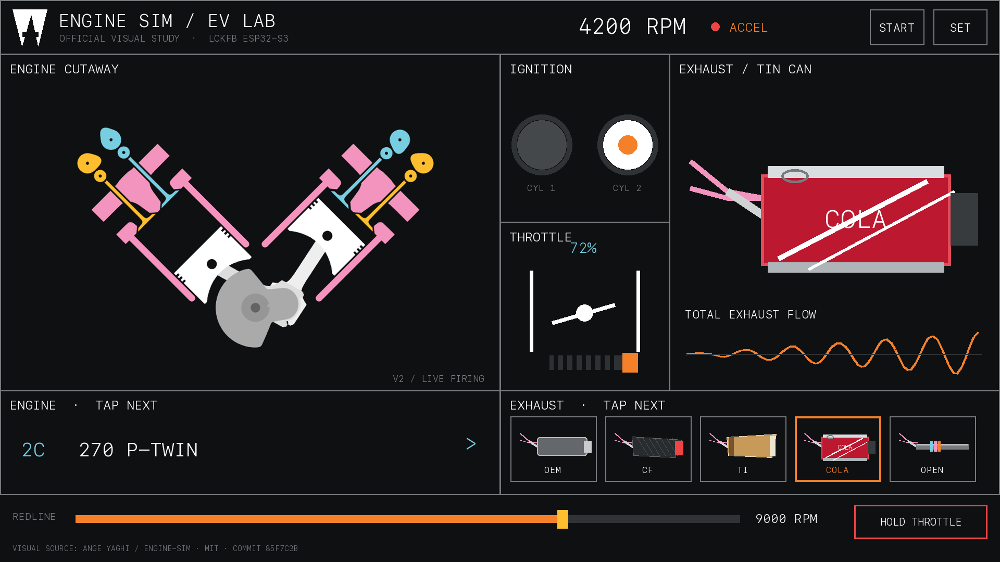
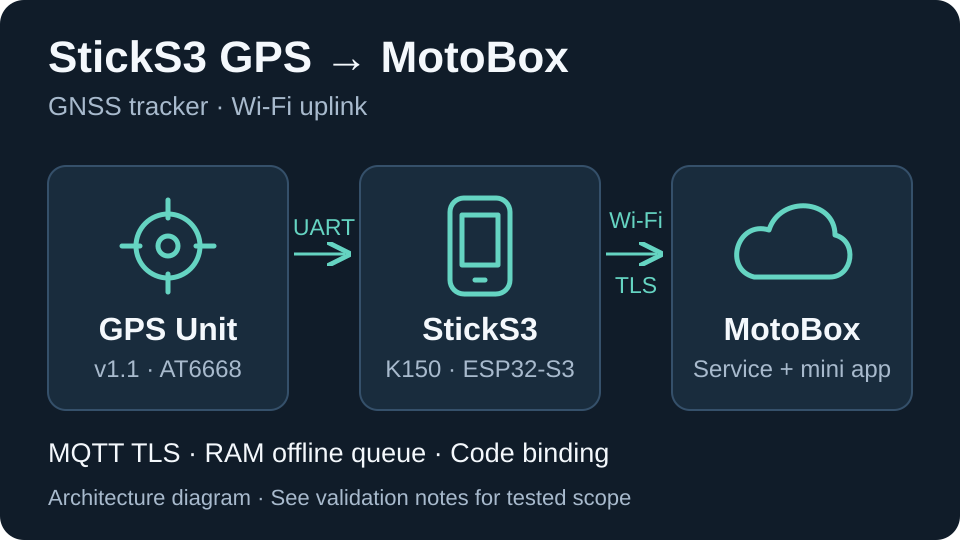

# DIY Electronics with AI

一个 AI-native、harness-friendly 的开放电子工程实验室：人负责目标、判断和真实世界验证，
AI Agent 负责检索、整理、实现、检查与协作编排。这里保存可复现的硬件 Demo、完整项目、
可复用驱动、接线依据、测试证据和去标识化工程经验，让其他电子爱好者和 Agent 都能直接复用，
而不只看到一段脱离硬件环境的示例代码。

项目身份为 **DIY Electronics with AI**，也称 **DIY Lab**，GitHub 仓库名为 `diy-electronics-with-ai`。
欢迎从一个项目的接线、运行步骤或验证记录开始体验，也把自己的实验整理成别人能接着使用的资料。

## 项目与 Demo 展示

从下面的设备项目了解这里能做什么；点击小图或名称查看硬件清单、接线和运行步骤。
**目前两个项目都仍在开发中**，已验证范围和待完成项分别列出。

| [摩托声浪模拟器 · EV Engine Sound](projects/ev-engine-sound/) · Project | [车辆定位终端 · StickS3 GPS → MotoBox](projects/m5stack-sticks3-gps-motobox/) · Project |
| --- | --- |
|  桌面设计预览 · [素材来源与许可](projects/ev-engine-sound/docs/third-party/engine-sim.md) |  工作原理示意 · 非实机照片 |
| ESP32-S3 实时合成发动机声浪，配合活塞与点火动画；18 种发动机配置、5 种排气音色。可先在电脑试听，再按板型构建固件。 | StickS3 + GPS Unit 的 Wi-Fi 定位终端，包含位置上报、离线队列和服务端验证码绑定。MotoBox 服务账号与凭据需另行开通。 |
| **开发中 · 已部分实机验证** · [`hardware-verified`](projects/ev-engine-sound/project.yaml) 已验证：StickS3 与立创实战派的部分功能；历史 ESP32-S3 板型仅构建通过。 待完成：其余实体交互、听感与视觉验收；v2 界面仍为电脑预览。 [验证记录与具体范围](projects/ev-engine-sound/docs/validation.md) | **开发中 · 原型** · [`prototype`](projects/m5stack-sticks3-gps-motobox/project.yaml) 已验证：构建、室内联网、状态上报、断网恢复、验证码显示与播报、小程序实机绑定，以及室外静止 GNSS 定位。 待完成：移动轨迹、定位精度与小程序位置/分享完整链路。 [验证记录与具体范围](projects/m5stack-sticks3-gps-motobox/docs/validation.md) |
| [硬件与运行说明](projects/ev-engine-sound/README.md) | [硬件与运行说明](projects/m5stack-sticks3-gps-motobox/README.md) · [中文图解手册](projects/m5stack-sticks3-gps-motobox/docs/manual/README.md) |

更多入口：[全部 Projects](projects/) · [全部 Demos](demos/)（目前暂无独立 Demo）。
状态含义见下方[状态词](#状态词)；图片用于说明项目，不替代验证证据。

## 从项目代码到图解说明书

仓库内置 **[`m5-product-manual` · M5 产品图解手册](docs/m5-product-manual.md)**：
根据官方硬件资料、当前固件和实测记录，先整理准确文案，再通过 Codex 内置 GPT 生图制作说明书。
它讲清接线、按键、屏幕状态与操作流程，也能解释设备、后台和用户端怎样组成一个 Demo。

| 图解样页 · 点击查看 | 说明与体验 |
| --- | --- |
|  | **MotoBox GPS：三页操作手册 + 一页技术原理** 接线、按键、状态、联网绑定与排查；再解释定位、平台账号和微信分享。 [四页手册](projects/m5stack-sticks3-gps-motobox/docs/manual/README.md) · [原理与 Demo](projects/m5stack-sticks3-gps-motobox/docs/manual/README.md#5-技术原理各部分如何组成定位-demo) [技能介绍与灵感来源](docs/m5-product-manual.md) · [安装与调用](docs/m5-product-manual.md#如何使用) |

图稿保留对应固件版本，最新验证范围见配套手册。说明图用于理解项目；实际使用仍要核对硬件、固件与验证记录。

## 内容入口

- [`projects/`](projects/)：可独立构建、具有明确用途的完整工程。
- [`demos/`](demos/)：验证一种模块、接口或组合的最小可复现实验。
- [`components/`](components/)：经过复用验证的驱动和公共组件。
- [`boards/`](boards/)：开发板能力、引脚、电源和已验证配置。
- [`catalog/`](catalog/)：主流厂商、产品系列、规格字段和官方资料入口。
- [`hardware/`](hardware/)：原理图、PCB、线束、外壳和机械设计。
- [`docs/`](docs/)：仓库约定、协作方法和开源发布检查表。
- [`templates/`](templates/)：新建 Demo/项目时复制的模板。
- [`tests/`](tests/)：跨项目验证、硬件在环和日志检查工具。

## 基本原则

1. 一个 Demo 只证明一个主要结论，并给出复现步骤。
2. 接线前记录电压、电流、逻辑电平、引脚冲突和供电风险。
3. 编译通过不等于硬件验证通过；状态必须明确区分。
4. 串口日志、测量数据和测试脚本优先于照片或主观描述。
5. 失败实验也保留结论，但不提交密钥、订单隐私、固件备份和大体积构建产物。
6. 物料购买记录使用本机全局电子物料库，不复制进 Git；购买数量不等于现存库存。

## 人 + AI 协作入口

仓库以 `.agents/` 和 `AGENTS.md` 为规范源，便于 Codex、Claude Code 以及其他兼容 Agent
共享同一套项目规则和技能。`.claude` 指向 `.agents`，`CLAUDE.md` 指向 `AGENTS.md`，因此
不要在兼容入口维护重复内容。仓库内置的 `diy-electronics-materials` 技能只提供查询工具和数据
约定；个人库存数据库仍保存在用户数据目录中，不进入版本控制。

产品目录保存经过归一化的事实、验证状态和官方来源链接，不收录来源不明的参数，也不整份
复制厂商手册。目录内容用于选型和发现资料，实际接线前仍需核对具体 SKU、硬件修订版和原理图。

仓库也提供一组职责明确的用户级 Agent Skills。克隆后运行 `./scripts/install-agent-skill.sh`，
其他项目中的 Agent 就能分别查询知识、维护产品目录、建设硬件项目、制作 M5 图解说明书，并把验证后的成果通过
Commit 或 PR 贡献回同一个 Git 仓库。显式调用使用 `$diy...` 或 `$m5-product-manual`，不是用于搜索文件的 `@`；
中文速查、安装和跨项目流程见 [`docs/AGENT_SKILL.md`](docs/AGENT_SKILL.md)。

这里把“AI-native”当作一种工程组织方式，而不是给传统仓库附加一个聊天入口：

- 任务边界、目录职责、安全规则和验证要求以 Agent 可直接读取的文件表达。
- 公开事实、工程经验、项目实现和 Git 贡献由不同 Skill 分工，便于 harness 组合与审计。
- 每个结论都尽量附带来源、验证等级或可复现步骤，Agent 不以推测补齐硬件事实。
- 私有资料留在仓库之外；只沉淀公开可核验资料和去标识化、可迁移的工程经验。
- 兼容入口只是适配层，规范源保持唯一，使不同 Agent harness 能在同一套约束下协作。

因此，这个仓库也可作为一种开放范式：把电子工程知识、真实硬件验证和 Agent 工作流放在
同一个可版本化、可审查、可复现的协作系统里。

详细约定见 [`docs/PROJECT_STRUCTURE.md`](docs/PROJECT_STRUCTURE.md) 和
[`docs/AI_COLLABORATION.md`](docs/AI_COLLABORATION.md)。同类开源项目与许可证边界的调研见
[`docs/research/open-source-electronics-catalogs.md`](docs/research/open-source-electronics-catalogs.md)。

## 状态词

`idea` → `prototype` → `build-verified` → `hardware-verified` → `stable`

| 状态 | 面向使用者的含义 |
| --- | --- |
| `idea` | 规划中，尚未形成可复现实现。 |
| `prototype` | 开发中，已有原型，关键验收仍未完成。 |
| `build-verified` | 开发中，构建已通过，硬件效果待验证。 |
| `hardware-verified` | 已有实机验证；必须查看具体板型、版本与验证范围，可能仍在开发中。 |
| `stable` | 当前声明范围已完成并通过验收，进入稳定维护；不代表所有设想功能都已实现。 |
| `retired` | 已停止维护，保留退役原因和替代方案。 |

状态以各项目的 `project.yaml` 和验证记录为准。只有达到 `stable` 且声明范围的验收完成，
才在展示区标为“已完成 / 稳定维护”；部分硬件验证不能代替项目完成验收。

## 开源许可

本仓库以 [MIT License](LICENSE) 开源。使用、修改、分发或商用时，请保留原版权和许可声明。
厂商文档、商标、外部链接内容及硬件资料仍归各自权利人所有；仓库中的引用不改变其原始许可。
