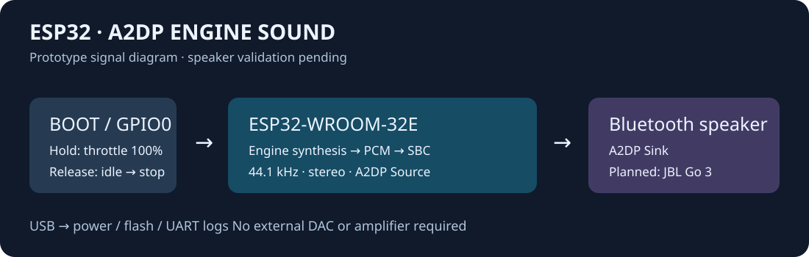

# ESP32 A2DP Engine Sound

用原版 ESP32-DevKitC 的 BOOT 按键控制程序化摩托声浪，经 Bluetooth Classic A2DP
Source 发给蓝牙音频接收设备。复用 [EV Engine Sound](../../projects/ev-engine-sound/) 的合成核心，
不需要外接 DAC、功放或另一块主控。这是独立链路实验，不能替代原项目 S3 固件。



**开发中，蓝牙实听待验收。** 构建及具体实机检查范围以 [验证记录](docs/validation.md) 为准。
已烧录原版 ESP32，120 秒无接收设备扫描/合成/串口控制检查通过；Beats Flex 首轮
90 秒、进入配对模式后的 120 秒复扫均未发现目标。现已加入 Wi-Fi AP 配网页面，
AP 与扫描共存的 120 秒稳定性检查通过；蓝牙音频传输仍未验证。

## 硬件与接线

| 部件 | 精确型号 / 已识别信息 | 连接 |
| --- | --- | --- |
| 开发板 | ESP32-DevKitC / ESP32-WROOM-32E；ROM 识别 ESP32-D0WD-V3 rev v3.1，4 MB Flash，CP2102N | 板载 Micro-USB 接电脑 |
| 油门 | 板载 BOOT，GPIO0，低电平有效 | 无额外接线，30 ms 去抖 |
| 音频接收设备 | 当前测试目标 Beats Flex 蓝牙耳机；A2DP Sink | 蓝牙，耳机自身供电 |

开发板 PCB 丝印修订号尚未人工核对；ROM 只能证明芯片修订，不能证明 PCB 版本。
依据乐鑫 DevKitC V4 官方接口定义使用 GPIO0；不要把 ESP32-S3-DevKitC-1 当作此板。
只用 USB 5 V 供电，GPIO 为 3.3 V 逻辑。本 Demo 不从排针为耳机供电。
USB 实测峰值电流尚未测量；无线部分有电流突发，使用合格数据线与供电端，不并联 USB、
5 V 排针或 3V3 排针供电。本轮不连接车辆电源或油门手把。

## 使用

1. 开机/复位时松开 BOOT；按住 BOOT 再按 EN 会进入下载模式。
2. 开发板会启动 `EV-Engine-Setup` Wi-Fi AP；默认密码每次启动随机生成并显示在 USB 串口。
   也可用串口 `ap_pin <八位数字>` 将固定数字密码保存到板上 NVS，设置成功后开发板自动重启，
   后续启动沿用该密码。当前测试板已经设置本地数字密码，具体值只通过用户会话告知。
   手机重新加入热点后，系统可能自动弹出“登录网络”配对页；提示无互联网时保持连接。
   若没有弹页，在浏览器手动打开 `http://192.168.4.1/`。更新固件后可先在手机上忽略旧热点，
   再重新加入，使手机重新获取配网页面通告。
3. 让 Beats Flex 进入指示灯闪烁的配对模式，避免同时连接手机或电脑。在页面最近 30 秒的
   经典蓝牙扫描列表中点选它；如设备不在列表，先检查耳机仍在配对模式。列表允许点选
   无名称的设备，但须先确认其身份，避免连到周围其他设备。
4. 也可用串口 `peer Beats Flex` 保存精确名称，供无页面时自动发现。出厂默认目标为
   `JBL Go 3`，当前测试板 NVS 已保存 `Beats Flex`。页面点选时按当前扫描结果直接连接，
   不依赖名称精确匹配。
5. 连接后板子启动静音音频流；开机发动机默认关闭、软件音量 20%。
6. **按住 BOOT：启动并给 100% 油门；松开：收油回怠速，3 秒后自动熄火。**
   耳机本身的音量单独控制，初次使用先调低。
7. 断连会清除运行和油门状态；重新连接后需重新按 BOOT。自动重连的实际兼容性待实测。

声浪默认 270° 双缸、原厂排气；支持核心的 18 种发动机和 5 种排气。
没有接收设备时合成与串口控制仍运行，但 PCM 不发送，日志的 `connected=0 streaming=0`
和 `callbacks=0` 是正常状态，不能作为音频外放成功的证据。

## 构建、烧录、观察

从完整仓库构建，不能仅复制 Demo 子目录（它引用项目的声浪核心）。使用 ESP-IDF **5.5.2**：

```sh
. "$IDF_PATH/export.sh"
cd demos/esp32-a2dp-engine-sound/firmware
idf.py set-target esp32
idf.py build
idf.py -p /dev/cu.YOUR_DEVICE -b 115200 flash
cd ..
python3 tools/verify_device.py /dev/cu.YOUR_DEVICE \
  --reset --exercise --seconds 120 --log build-evidence/offline.log
```

烧录前根据 VID/PID、USB 位置、描述核对设备，读取芯片信息并保存私有 Flash 备份。
设备路径不能在不同电脑间照抄。上面脚本需要 `pyserial`；原始日志、固件备份保持在
本地忽略目录/仓库外，不要提交。

耳机就绪后的测试，先确认串口 `TARGET_FOUND`、`connection=2`、`AUDIO state=1` 及 PCM 回调持续递增；
连接稳定后捕获，避免将刚连接时的初始化与稳定段混在一起：

```sh
python3 tools/verify_device.py /dev/cu.YOUR_DEVICE \
  --exercise --require-streaming --seconds 120 --log build-evidence/speaker.log
```

实际声音、BOOT 实体按键、断电重连和延迟还须按验证记录完成验收。
工具结束时发送 `stop`，不会在后台占用串口。

可选 `--pulse-boot --seconds 40` 用 CP2102N 的 DTR/板上自动下载电路触发 GPIO0，
检查固件油门输入路径；须与 `--exercise` 分开运行，并松开实体 BOOT。输入脉冲不主动控制 EN；
本机驱动打开串口时曾触发一次启动复位，日志会记录。它不能替代手指按压机械按键的验收。
其他 USB-UART 接线未验证，不应盲用该选项。

## 串口命令

115200、8N1；可使用原项目的 `tools/console.py`，或任意串口终端（不要与验证工具同时打开）。

```text
peer Beats Flex
profile twin270
exhaust stock
volume 20
start
throttle 70
throttle 0
stop
status
tasks
```

`peer <完整广播名>` 在未连接时更新目标，保存到板上 NVS，重启保留；大小写和空格必须一致。
`ap_pin <八位数字>` 只接受八位 ASCII 数字，保存到 NVS 后自动重启 AP；日志不回显密码。
用户自设的密码只存在本地设备和私有串口操作中，不写入仓库。
软件不会打印周围无关设备的名称/地址。`status`/`tasks` 请求下一次心跳输出任务栈余量。
串口 `throttle 0` 后同样 3 秒自动熄火；`stop` 走声浪核心的平滑停机过程。
不启用共享核心的 `bootloader` 命令，以免误触发下载状态。

## 主机测试

```sh
cmake -S tests -B build-host
cmake --build build-host
ctest --test-dir build-host --output-on-failure
```

覆盖 BOOT 抖动、长按、释放、长时间计时，以及 44.1 kHz 下全发动机的启动、给油、收油、
停机、重启和输出范围。不能据此声称蓝牙传输已经成功。

## 限制与资料

- Bluetooth Classic A2DP + SBC；不是 BLE 音频。Wi-Fi 只提供本地 AP 配网页面，
  不接入互联网；不包含 SD、4G、车辆接口。
- AP 通过 DHCP captive portal 地址通告、DNS 解析和 HTTP 重定向协助手机发现页面；
  是否自动弹窗由手机系统决定，手动 IP 地址始终可用。HTTPS 页面无法被 HTTP 重定向。
- AP 与蓝牙共用 ESP32 2.4 GHz 无线电。AP 已完成无音频 120 秒扫描稳定性检查，
  **AP + A2DP 同时传输的音频连续性、欠载和栈余量仍待测**。本次构建的应用分区仅余约 2%。
- 合成核心直接运行在 44.1 kHz，复制为左右相同的双声道；部分滤波常数按采样点定义，
  因而音色可能与原 32 kHz 版本不同。此 Demo 没有验证两者听感一致。
- 约 46 ms 的目标 PCM 缓冲叠加编码和耳机自身延迟；端到端延迟必须实测。
- 不控制耳机绝对音量，不实现 AVRCP 媒体键。支持无输入/输出 SSP 和常见 `0000` 旧式 PIN；
  需输入其他 PIN 的设备不在当前范围。
- 详细并发与栈预算见 [设计说明](docs/design.md)，已测和待测见 [验证记录](docs/validation.md)。
- [乐鑫 ESP32-DevKitC V4 用户指南](https://docs.espressif.com/projects/esp-dev-kits/en/latest/esp32/esp32-devkitc/user_guide.html)：USB 供电、GPIO0、BOOT/EN；访问 2026-09-25。
- [ESP-IDF v5.5.2 A2DP Source 示例](https://github.com/espressif/esp-idf/tree/v5.5.2/examples/bluetooth/bluedroid/classic_bt/a2dp_source)：协议初始化和状态流程参考；本 Demo 应用代码自行实现。
- [ESP-IDF A2DP API](https://docs.espressif.com/projects/esp-idf/en/v5.5.2/esp32/api-reference/bluetooth/esp_a2dp.html)：Source API、PCM 回调及 SEP 配置。
