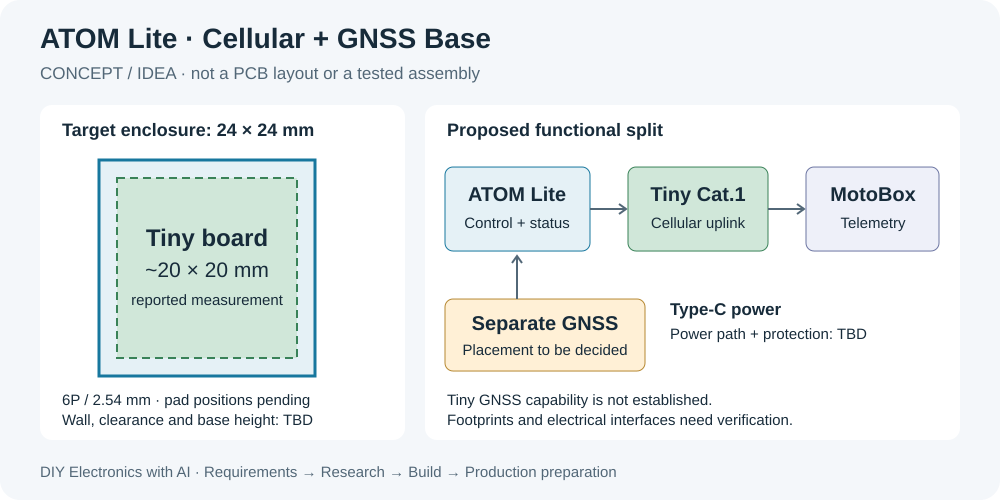

# ATOM Lite 4G/GNSS 堆叠扩展底座

为 ATOM Lite 制作一款 **24 × 24 mm 外轮廓**的堆叠底座，参考 ATOMIC ECHO BASE 的安装形态，
采用通信核心板、主机适配 PCB 与 3D 打印外壳，评估以同一核心板扩展 StickS3 顶部适配版本。
通过 Type-C 供电，实现开机自动联网、定位并上报 MotoBox。完整保留需求、调研、原理图、PCB、
固件、验证、试产和量产准备过程，作为 DIY Lab 的开放教学项目；ATOM 是首个实现目标。

**当前状态：`idea`，已立项，正在确认硬件输入。没有已完成的原理图、PCB、固件或实机验收。**
24 × 24 mm 是外设外轮廓目标；Tiny 独立卡扣外壳已建模，暂高 11.8 mm，完整底座的 PCB 板框和高度尚未确定。



## 原始输入与硬件

| 项目 | 已知信息 | 来源与限制 |
| --- | --- | --- |
| 主控 | M5Stack ATOM Lite / C008；ESP32-PICO-D4 | [产品目录](../../catalog/vendors/m5stack/products/atom-lite-c008.yaml)；不是 AtomS3 |
| 主控外壳 | 用户实测 24 × 24 × 9.6 mm；官方 24 × 24 × 9.5 mm | 两组值分别保留，不把官方标称替换成实测值 |
| 底座形态 | 与主控相同的 24 × 24 mm 外轮廓，上下堆叠 | 参考 ECHO BASE 的形态；不承诺与其他底座同时叠加 |
| 外壳路线 | 主机专用 3D 打印外壳，承担固定与插拔受力 | 打印模型、材料、尺寸公差与装配均未验证 |
| 第二主机候选 | StickS3 K150，官方 48 × 24 × 15 mm，顶部 16P Hat2 | [板卡接口资料](../../boards/m5stack-sticks3-k150/README.md)；另做适配 PCB 与外壳，尚不列为已支持主机 |
| 通信候选 | 芯引者 ML307R-DL Tiny 核心板 | 用户提供的商品图识别；实物修订、供电与电平仍待核对 |
| Tiny 尺寸 | 用户实测约 20 × 20 mm；商品图标注 20 × 19 × 6 mm | 尚不清楚商品高度是否包含插针，测量基准和公差未给出 |
| Tiny 接口 | 单排 6P；用户报告节距 2.54 mm | 商品图正向右侧上→下：BAT、EN、RX、TX、GND、VIN；不是已核实的封装 Pin 1 定义 |
| GNSS | 第一轮建议复用 Unit GPS v1.1；后续决定是否集成 | ML307R-DL Tiny 本轮没有 GNSS 能力证据，不能当作 Air780EG 使用 |
| 电源 | Type-C 供电、上电自动运行 | 输入位置、电源分配、防倒灌、峰值电流均待设计与验证 |

原话、商品图观察及差异见 [原始需求](docs/brief.md)。项目不保存个人库存、订单或带设备识别号码的原图。

## 设计方向

用户已确定顺序：**先做 Tiny 打印外壳，再设计 ATOM / StickS3 两款适配 PCB**。
已完成[底壳＋卡扣上盖 Rev B](hardware/enclosure/README.md)，提供朝下和侧向两种 6P 排针出口，
外形暂定 24 × 24 × 11.8 mm。STEP/STL 几何检查通过；含针尺寸、板托接触区与打印实物配合仍需验证。
GNSS 首版提议采用[独立四线接口与第二路 UART](docs/gnss-uart-expansion.md)接现成接收板。

已完成[首轮 PCB 设计调研](docs/pcb-design-research.md)，包含两款主机 GPIO 分配提案、电源路径、
电平转换候选与落图前缺口。ML307R 裸模组使用 1.8 V UART，不能据此认定 Tiny 已有 3.3 V 转换；
Tiny 板级资料及 GNSS 当前修订电平确认后，再冻结接线与原理图。
已在内置浏览器建立 [EasyEDA 原生工程框架](hardware/easyeda/README.md)，五个功能页保存重开回读通过；
页面仍为空电路草稿，PCB 尚无板框、器件或布线。

电子功能先用 **ATOM Lite + Tiny Cat.1 + 独立 GNSS** 的最小实验核验，再完成自研载板和项目固件。
首版用“现有 Tiny + 一块主机适配 PCB”，两种主机尽量复用通信电路与软件协议，分别处理接口与结构。
StickS3 可以做顶帽，或由顶部接入后将模块沿背面放置，详见[主机适配方案](docs/host-adapters.md)。
将蜂窝模组、SIM、GNSS 和电源全部放进一块 PCB 是后续选项，
需要重新评估 24 mm 轮廓内的空间、射频、电源和制造成本。

这是独立工程。既有 [StickS3 GPS → MotoBox](../m5stack-sticks3-gps-motobox/) 提供协议与解析经验；
其 ESP32-S3 固件、PSRAM 设置、板级引脚和硬件验证不能直接用于本项目。

## 文档入口

1. [原始需求与测量记录](docs/brief.md)
2. [需求与验收条件](docs/requirements.md)
3. [蜂窝通信与 GNSS 选型调研](../../docs/research/m5stack-cellular-gnss-selection.md)
4. [系统架构与设计决策](docs/architecture.md)
5. [ATOM / StickS3 适配 PCB 与打印外壳](docs/host-adapters.md)
6. [PCB 与结构设计输入](hardware/README.md)
7. [需求到量产的教学路线](docs/teaching-plan.md)
8. [验证记录](docs/validation.md)与[测试计划](tests/README.md)
9. [PCB 设计调研与来源](docs/pcb-design-research.md)、[接口分配提案](hardware/pcb-interface-plan.csv)及[器件候选](hardware/pcb-part-candidates.csv)

## 接线与供电

当前没有可直接照接的接线表。[接口核对表](hardware/interface-review.csv)记录可见标注与未知项。
连接 Tiny 之前需要查清 VIN/BAT 的范围、EN 有效电平、UART 电压域及插针正反面。
ATOM 的 5V、3V3 和 GPIO 不应按接口名称直接与 Tiny 连接。

单 Type-C 是使用体验目标。初步建议由底座进行供电分配，但仍需与“从 ATOM 的 Type-C 输入”方案
比较空间和载流能力。ATOM 调试口与底座供电同时插入时必须验证防倒灌。
StickS3 版本需区分 Hat2 的 `5V_IN` 与 `EXT_5V`；初步评估从前者给主机输入电源，4G 独立分路。
其 Grove 标称带载最大 4.88 V @ 0.38 A，不作为蜂窝电源能力保证。

## 构建、烧录与运行

尚无可烧录固件或可投板文件。本阶段可从仓库根目录阅读设计输入；目录校验需 Python 3 与 PyYAML：

```sh
python3 -m json.tool projects/atom-lite-cellular-gnss-base/hardware/design-inputs.json
python3 catalog/tools/validate_catalog.py
```

计划使用 ESP-IDF（目标 `esp32`），具体版本在首次实现时锁定；PCB 通过 EasyEDA Pro 的 typed CLI
与参数化数据维护。确认接口后先在 `demos/` 建立最小组合实验，再将已验证实现接入本工程。
届时补入完整 build/flash/run 命令及所需工具版本。

## 预期行为

首次完成设备开通、SIM/APN 配置与绑定后：通电 → 自检 → 自动注册蜂窝网络 → 连接 MQTT TLS →
先上报在线/等待定位 → 得到新鲜有效 GNSS 位置后上传 → 断线自动恢复。
“上电自动上报”不表示通电瞬间已有有效位置。断电后停止工作；当前范围不包含电池续航。

## 限制与下一步

- Tiny 商品图不能证明供电、电平、GNSS 或精确机械兼容性；需要实物和板级资料。
- 24 × 24 mm 内容纳 Tiny、连接器和结构件尚未验证；天线与线缆是否允许伸出由结构方案记录。
- EasyEDA 原生工程框架已创建；后续只使用内置浏览器。电气连接、封装、PCB 布局布线及 DRC 均待完成。
- StickS3 仅完成公开接口与供电资料核对，尚无适配器原理图、打印模型或实物兼容测试。
- 量产是项目目标；批量、单价、良率、认证和制造文件均未定，尚不能投产。

本阶段回退点是保留原始需求和已有独立模块；后续用硬件修订与固件提交关联每次实验，不覆盖旧证据。
