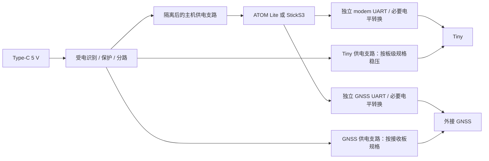

# 适配 PCB 设计调研

日期：2026-09-27。阶段：原理图前的设计输入。公开资料已查阅，GPIO 分配和器件仍是候选；
没有原生原理图、PCB、通电或装配验证。项目保持 `idea`。

## 1. 首版建议

先做 **ATOM Lite 适配 PCB + 现有 Tiny + 外接 GNSS**，随后做独立的 StickS3 Hat2 适配 PCB。
两板复用电源、串口接口和测试方法，分别定义主机连接器、GPIO、板框与安装结构。
GNSS 第一轮使用 M5 Unit GPS v1.1；自研 GNSS 射频小板留到体积和成本目标明确后评估。

本轮沿用外壳提交 `6e60b92`：默认朝下 6P 排针、24 × 24 × 11.8 mm、底壳独立天线圆孔。
PCB 研究未调整外壳、排针或板托坐标。该壳是 Tiny 独立保护壳，还没有证明能装入适配 PCB。

已有足够资料确定双 UART 架构，但 **Tiny 板级供电、电平和 EN 定义是落图前的首要缺口**。
同样使用 ML307R-DL，不代表 Tiny 与 M5 Unit Cat1-CN 有相同的外围电路。

## 2. 查到的电气事实与适用范围

| 对象 | 官方资料中的事实 | 对本项目的影响 |
| --- | --- | --- |
| ML307R 裸模组 [S1] | VBAT 3.4–4.5 V，典型 3.8 V；最大发射时瞬态可达 2 A；手册建议供电器件输出超过 2 A，VBAT 至少并联两颗 220 µF | 这些是模组端要求，不能直接当成 Tiny 的 VIN 或 5 V 输入电流规格 |
| ML307R UART [S1] | UART 为 1.8 V 逻辑；UART0_RXD 为脚 17，UART0_TXD 为脚 18；3.3 V TTL 需电平转换 | 先查 Tiny 是否已经转换，再选择直连或转换电路 |
| ML307R 控制 [S1] | VDD_EXT 脚 24 输出 1.8 V / 50 mA；PWR_ON/OFF 有专门上电时序 | Tiny 六针没有明确的 VDD_EXT；不能把 EN 当成裸模组 PWR_ON/OFF |
| M5 Unit Cat1-CN [S2] | V0.2 原理图用 SY8003ADFC 将 5 V 转为 3.6 V，并有 SS8050 UART 电平电路及 ML_PWR 下拉 | 可学习功能分块，不复制为 Tiny 的板级规格；参考图 UART 外侧上拉也不是直接标成 3.3 V |
| ATOM Lite [S3] | 底部可用 GPIO 为 19、21、22、23、25、33；Grove 为 26、32；板载 RGB 27、按键 39、红外 12 | 底部有资源分配两路 UART，并留控制/备用信号 |
| StickS3 [S4] | 顶部 16P Hat2；有独立 `5V_IN` 和受电源模式影响的 `EXT_5V`；Grove 带载最大 4.88 V @ 0.38 A | 蜂窝独立供电分路；主机供电先评估 Hat2 的 `5V_IN` |
| M5 GPS Unit v1.1 [S5] | 页面标为 ATGM336H-6N / AT6668、5 V、31.64 mA、默认 UART 115200；48 × 24 × 8 mm | 第一轮外置；页面电流不作为整个 GNSS 兼容接口的最大额定值 |

### Tiny 上仍不能填写的值

VIN/BAT 电压范围及关系、UART 实际逻辑电平、EN 极性/电压/时序、默认波特率、输入峰值电流、
稳压与电平转换是否已装，均未取得该板修订对应的证据。继续在设计 JSON 中保留 `null`。
商品图可见 `Tiny CORE`、`V1.1` 等字样，只作为找资料线索，不等于已经核对手头实物修订。
BAT 保持未分配，不接电池、不与 VIN 短接；原理图中也不能先用 NC 标记代替调查。

### GPS 页面与原理图不一致

[S5] 页面链接的 `U032-V11-UNIT_GPS_SCHE.pdf` 标题栏为 **UNIT-GPS / V1.0 / 2018-10-16**，
图中接收模块为 **GP-02**；与页面当前 AT6668 描述不能直接对应。
因此本轮只引用页面的接口和产品参数，不从这张旧图推断当前 U032-V11 的 UART 电压域。
接线前需取得对应板版的图纸，或结合器件资料和实物测量确认输入容限及输出电平。

## 3. 主机 GPIO 分配提案

以下是项目分配，不是厂商默认 UART 映射，也不是可直接接线的封装针序。
完整表见 [pcb-interface-plan.csv](../hardware/pcb-interface-plan.csv)；主机与外设间可能经过电平转换。

| 功能（主机视角） | ATOM Lite 提案 | StickS3 提案 | 外设端 |
| --- | --- | --- | --- |
| MODEM_TX | G19 | G5，Hat2 文档针 2 | Tiny RX，电平待核 |
| MODEM_RX | G22 | G6，Hat2 文档针 6 | Tiny TX，电平待核 |
| GNSS_TX | G23 | G7，Hat2 文档针 8 | GNSS RX，配置输出 |
| GNSS_RX | G33 | G8，Hat2 文档针 9 | GNSS TX，NMEA 输入 |
| MODEM_CTRL 预留 | G25 | G4，Hat2 文档针 4 | 经确认后的 EN 控制电路，不预设直连 |
| 备用 | G21 | 本轮不分配 | 后续按实际需要使用 |

ATOM 保留 UART0 下载/日志，避免使用 ESP32 UART1 的默认 Flash 相关引脚，固件显式设置路由。
G21/G25 在官方例子中也用于 I²C，使用本提案时不可同时初始化该 I²C 映射。
Grove G26/G32 可作台架 GNSS 接入备选；它与上述底座 GNSS 方案是不同配置。

StickS3 提案避开 Boot、G3 启动相关信号及 G43/G44 调试串口。
官方 Hat2 逻辑针号已记录在[板卡档案](../../../boards/m5stack-sticks3-k150/README.md)，
还需核对顶部视图与配对件镜像关系，才能转成 PCB pad 编号。

两个外设使用独立 UART，两路设备 TX 不相连。两种主机都先保留调试通道，
波特率分别配置；双串口资源足够不等于已经验证并发不丢数据。

## 4. 电源方案与选择条件

建议外部 Type-C 的 5 V 先进入载板，再分成主机、Tiny、GNSS 三条支路。
这能把蜂窝脉冲电流与主机连接器的载流限制分开检查，输入位置仍需结构验证。

### Tiny 支路：先确定板上已有电路

- 若资料确认 VIN 接受 5 V、板上稳压可承受所需瞬态：评估受保护的 5 V 支路直接给 VIN。
- 若仅允许裸模组电源域：设计满足其实际输入范围的降压供电。不能把裸模组 VBAT 接 5 V。
- 若 UART 已转换到主机兼容电平：检查阈值与掉电行为后再确定直连。
- 若 UART 仍是 1.8 V：评估 TXU0202，另解决低压侧供电来源与使能时序。
  独立产生 1.8 V 并不能证明 modem 已上电；OE 应有可靠的默认关闭状态。

ML307R 手册 2 A 是模组 VBAT 侧的瞬态。例如只为预算估算，按 3.8 V × 2 A、5 V 输入及
90% 转换效率，蜂窝支路输入约为 **1.69 A**，还没加主机、GNSS、线损与裕量。
这是带假设的换算，不是 Tiny 实测功耗，也不是已选定的供电额定值。

估算压降时同时考虑线路电阻和瞬态：`ΔV ≈ I·R + ΔI·Δt/C`。
电容 ESR、降容、稳压器响应及线缆必须一起核对；不以固定线宽或堆大电容替代带载波形验证。
[S1] 的储能建议应与 Tiny 已有电路合并评估，不能盲目重复布置。

### Type-C 受电

受控台架原型可比较独立 CC1/CC2 的 5.1 kΩ Rd 方案；完整方案评估 TUSB320 的电流广告检测，
在可用电流满足预算后再开启蜂窝支路。两颗 Rd 只表明受电端，不能保证源端提供 3 A。
使用 CC 控制器时按其手册配置终端，不重复添加本应由芯片提供的 Rd。
第一轮按 5 V 供电口评估，不要求 USB 数据或 PD 升压；连接器、ESD、限流/软启动还未定料。

### 主机 USB 与载板电源同时接入

ATOM 官方图 [S3] 显示 `VUSB_5V → D5 1N5819 → VBUS_5V → FUSE1 6V/1A → VGROVE_5V`，
底部 5 V 接点位于 VGROVE_5V。D5 的方向阻断图中回流到 USB 的路径，1 A PTC 也提示不能
把主机 USB 当成已验证的蜂窝供电通道。图中 USB 桥为 CH552T，页面另有 FTDI 驱动说明，
需将这张图与实物修订对应，不能由一张图承诺所有 ATOM Lite 双插安全。

载板的主机支路还需阻止“只有主机 USB 时，经主机反向给蜂窝支路供电”。
评估单向隔离及可断开的调试供电连接；若确实接入两个独立电源，再比较 TPS2121 电源选择方案。
电源选择芯片不能代替主机内部电源路径审核。StickS3 另核对 `5V_IN`、`EXT_5V` 与电池路径。

| 供电状态 | 原理图和实测应证明的行为 |
| --- | --- |
| 只有载板 Type-C | 三支路正常，主机 USB VBUS 没有向外供电 |
| 只有主机 USB | 可调试主机，蜂窝电源支路隔离；关闭模块不被 UART 反向供电 |
| 两个 USB 都接 | 电源不互相顶电压，插拔时无异常回流、复位或过热 |
| 任一外设断电 | 串口保持安全状态，另一外设和主机调试仍可工作 |

## 5. GNSS 接口与机械边界

GNSS 接口保留供电、GND、`HOST_RX/GNSS_TX`、`HOST_TX/GNSS_RX`，针序和连接器料号待定。
供电电压与信号电平分开标注；若将来提供 3.3 V / 5 V 装配选项，必须互斥并有明确标记。
M5 成品用 5 V，不推广为所有市售 GNSS 板的供电标准。

[S5] 的 HY2.0 四线定义为黑 GND、红 5 V、黄 UART_RX、白 UART_TX（模块视角）。
本项目线束表还需确认端面方向；杜邦、Grove、SH、PH 等不共用未经核对的物理针序。
PPS 首版不要求，可留待后续测时需求；RX 配置线建议保留。更多边界见[GNSS 方案](gnss-uart-expansion.md)。

结构约束沿用现有设计：

- 24 mm 是外壳尺寸，内腔暂为 20.6 × 20.6 mm，适配 PCB 板框尚未定义。
- Tiny 默认 6P 朝下；2.54 mm 节距的首末中心跨度为 12.70 mm，不能据此确定孔到板边坐标。
- 保留板底 z=2.4 mm 和底厚 1.4 mm，目前净空仅 1 mm；SIM 卡座及射频座配合未验证。
- 带连接器的适配 PCB、Type-C 插座和线缆都需要单独的高度与插拔空间核对。
- LTE 继续从 Tiny 射频座接外置 FPC 天线；首版载板不转接射频走线。
  圆孔、插头穿过尺寸和线缆弯曲半径待实测，5 dBi 仅为商品标称。

布板时先落实连接器/禁布区，再决定层数。比较两层与四层的完整地参考、供电回路、成本和空间，
不在没有板框和电流路径时冻结层叠。GNSS 与 LTE 同时工作时还需测接收质量及电源噪声。

## 6. 已查手册的器件候选

这些是供落图比较的候选，不是最终 BOM；未核对嘉立创库存、单价、库 UUID 或可贴装服务。
结构化记录见 [pcb-part-candidates.csv](../hardware/pcb-part-candidates.csv)。

| 料号 / 封装 | 用途和查到的能力 | 采用条件 |
| --- | --- | --- |
| TI TXU0202DCUR / VSSOP-8 DCU [S6] | 双电源 1.1–5.5 V，一路 A→B、一路 B→A；有 OE、Ioff | Tiny 或 GNSS 的 UART 确需转换，并已解决两侧供电与掉电控制 |
| TI TPS2121RUXR / VQFN-HR-12 RUX [S7] | 双输入电源选择，2.8–22 V，限流可设 1–4.5 A，具反向电流阻断 | 双输入电源拓扑确认需要，且热、压降和封装可接受；它不负责降压 |
| TI TUSB320IRWBR / X2QFN-12 RWB [S8] | Type-C CC 逻辑，供电 2.7–5 V，可识别默认/1.5 A/3 A 电流广告 | 需要自动判断源端电流能力；需配置 UFP 及检测后的负载控制 |

TXU0202 的候选连法：VCCA 接已验证的主机逻辑电源，VCCB 接已验证的模块逻辑电源；
主机 TX → A1（5），B1Y（8）→模块 RX；模块 TX → B2（1），A2Y（4）→主机 RX。
其余脚为 GND（2）、VCCA（3）、OE（6）、VCCB（7）。这是芯片引脚核对结果，不是已画好的 Tiny 接线。
最终符号和封装还需按 [S6] pin table、封装图、库器件三方复核。

## 7. 下一步需要补齐的设计输入

| 优先项 | 缺什么 | 如何取得 / 决定什么 |
| --- | --- | --- |
| P0 Tiny 电气 | 实物修订、VIN/BAT 范围与方向、UART 域、EN 定义、固件接口 | 取得对应板级原理图/规格；识别稳压与转换器件并核对手册；有安全供电依据后测量，决定电源与转换电路 |
| P0 Tiny 几何 | 板厚、6P 坐标/孔径/Pin 1、针长、两面最高件 | 固定基准实测，建立焊盘与禁布区；不要从商品图比例估尺寸 |
| P0 主机配对件 | ATOM 底部几何与真实供电路径；StickS3 Hat2 端面方向 | 官方工程图 + 实物通断/测量，确定配对连接器和 pad 映射 |
| P0 GNSS 电气 | U032-V11 当前修订原理图/电平；实际线束端面 | 解决旧图不匹配问题，确认输入容限和输出电平，再冻结端口 |
| P1 电源预算 | Tiny 上电、注册、发射峰值；线缆压降 | 分支测量与示波器波形，定电源额定值、储能、软启动和 Type-C 策略 |
| P1 机械叠装 | 适配 PCB、插座、SIM/RF/USB 净空和天线走线 | 装配剖面/试片，确认板框与高度，再开展需要的结构修订 |
| P1 精确选料 | Type-C/主机/Tiny/GNSS 连接器、保护、电源器件 | 数据手册 + 封装 + 可采购性，随后填写库 UUID 与 DNP 变体 |

优先索取 Tiny 的随货资料/商家原理图链接。若始终得不到足够板级证据，评估资料完整的核心板替代品，
保留现有外壳和原始输入；不依据 ML307R 裸模组手册猜测 Tiny VIN 的安全电压。

## 8. 从调研进入原理图

1. 补齐 P0，冻结两份 pin→net 表；ATOM 先行，StickS3 只复用已经证明适用的电路。
2. 在 `demos/` 建立最小组合实验，完成供电、电平、双 UART、注册和 GNSS 并发验证；记录修订及波形。
3. EasyEDA Pro 建独立工程：Power / Host / Tiny / GNSS / Test 五个功能区，未核引脚保持显式待办。
4. 按精确 MPN 和真实引脚表选符号/封装，typed CLI dry-run → apply → 连接回读 → ERC。
5. 机械输入冻结后做板框/连接器与布局布线，检查电源回路、可测性、DRC、保存重开回读及制造导出。

2026-09-27 工具检查：EasyEDA CLI/daemon 为 `v1.6.0-dirty`，daemon 可用，编辑器列表 `windows: []`。
只查询了 health、建工程命令帮助及电路块索引；未创建或修改原生 EDA 工程。
已有 USB/电源库块只用来发现候选，不能代替器件手册、引脚核对与本项目电源分析。

## 9. 来源与版本

均于 2026-09-27 查阅。只提交摘录、结论与官方链接；原厂 PDF/图片不复制进仓库。

- **[S1]** [中移物联 ML307R 硬件设计手册](https://m5stack-doc.oss-cn-shenzhen.aliyuncs.com/1189/M307R_Hardware_Datasheet.pdf)，AT 版本适用，V1.0.1，2023-09-01。
  印刷页 23 §3.2.1/Table 16 为供电，页 25/Table 17 为 VDD_EXT，页 27–28 为 UART，页 36 为上电时序。
- **[S2]** [M5 Unit Cat1-CN 页面](https://docs.m5stack.com/en/unit/Unit_Cat1-CN)及
  [V0.2 原理图，2025-09-09](https://m5stack-doc.oss-cn-shenzhen.aliyuncs.com/1189/SCH_Unit_Cat.1_SCH_V0.2_20250909_2025_09_09_14_17_11.pdf)。
  页面电流表的 FDD B39 / TDD B3 标签疑似对调，未用这些行计算预算。
- **[S3]** [ATOM Lite 官方页面](https://docs.m5stack.com/en/core/ATOM%20Lite)及其
  [原理图图片](https://static-cdn.m5stack.com/resource/docs/products/core/ATOM%20Lite/img-2e58eac3-d9ef-4be4-b486-d4dd9a8324fa.webp)。
  图中连接器符号名称不作为物理节距证据，底部封装还需机械图及实测。
- **[S4]** [StickS3 官方页面](https://docs.m5stack.com/en/core/StickS3)，Hat2-Bus / Power Supply 部分。
- **[S5]** [GPS Unit v1.1 页面](https://docs.m5stack.com/en/unit/Unit-GPS%20v1.1)及其
  [链接的原理图](https://m5stack-doc.oss-cn-shenzhen.aliyuncs.com/849/U032-V11-UNIT_GPS_SCHE.pdf)。版本不匹配见第 2 节。
- **[S6]** [TI TXU0202 手册](https://www.ti.com/lit/ds/symlink/txu0202.pdf)，SCES942A，2022-03 修订；页 1 特性、页 4 引脚、末尾订购表。
- **[S7]** [TI TPS212x 手册](https://www.ti.com/lit/ds/symlink/tps2121.pdf)，SLVSEA3F，2020-08 修订；页 1、特性/应用及订购表。
- **[S8]** [TI TUSB320 手册](https://www.ti.com/lit/ds/symlink/tusb320.pdf)，SLLSEN9F，2022-03 修订；页 1、CC 检测及订购表。

## A1 落图补记

[UART 候选子电路](../hardware/easyeda/README.md)已使用 TXU0202DCUR、两颗 100 nF 去耦和 100 kΩ OE 下拉。
ATOM 原备用 G21 提议用作 `UART_OE` 控制，GPIO 与连接器尚未接入原理图；仍需在两侧电源有效后使能。
该提案不确定 Tiny EN 功能，也不解决 `MODEM_VIO_TBD` 的电源来源。是否采用转换器仍取决于 Tiny 板级电平资料。
