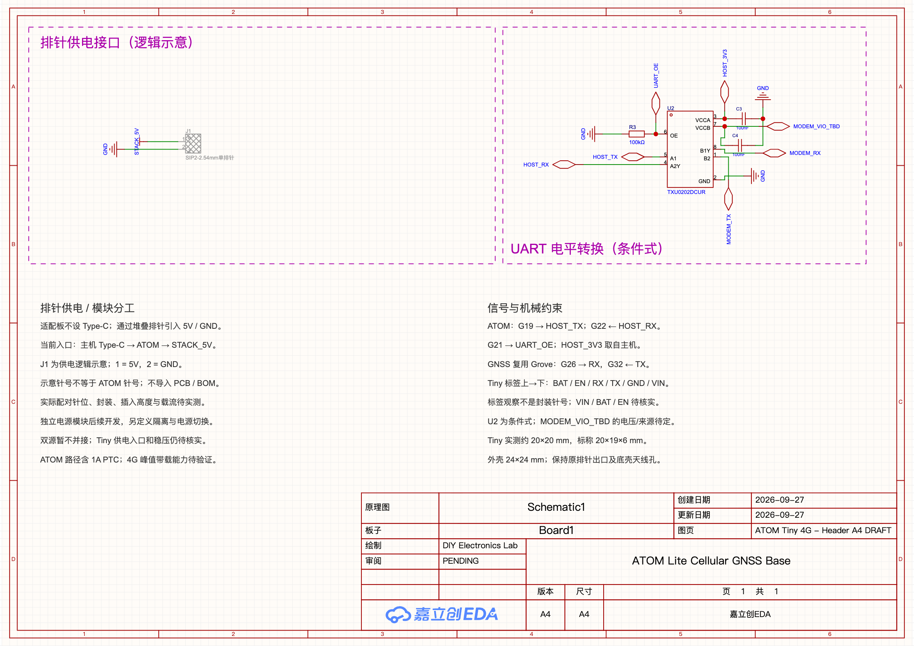

# EasyEDA Header A4 单页原理图草稿

[打开原生图纸](https://pro.lceda.cn/editor#id=247f2261614c4e20861e8a96a79cb7ba,tab=53dcd402e09040a2@247f2261614c4e20861e8a96a79cb7ba)

仅通过 Codex 内置浏览器中的 EasyEDA Pro Web 与 typed CLI 操作。
当前为一张 A4 图纸，包含排针受电逻辑示意、UART 条件式子电路及普通中文说明。
适配板已取消 Type-C；后续独立电源模块需求见[供电修订](../../docs/header-power-revision.md)。
项目仍为 `idea`，Tiny 电源、真实连接器、PCB、固件和实机验证尚未完成。

## 当前器件与连接

| 位号 | 选型与用途 |
| --- | --- |
| J1 | 两脚排针逻辑参考；1=STACK_5V，2=GND；`addIntoBom=false`、`addIntoPcb=false` |
| U2 | TXU0202DCUR / C5186957，条件式 UART 电平转换 |
| C3、C4 | CC0603KRX7R9BB104 / C14663，100 nF，两侧电源去耦 |
| R3 | 0603WAF1003T5E / C25803，100 kΩ，OE 默认下拉关闭 |

J1 的示意针号不是 ATOM 正式针号，符号料号 C9900009052 不代表选定采购连接器。
宿主将放置时的 J2 重编号为 J1；稳定 canonical ID 保留 `cmp-J2`，连接目标使用读回的 J1。
实际针位、封装、插入高度及载流待核实。图中参考符号的灰色斜线是排除制造的显示。

UART 引脚依据 [TI TXU0202 手册](https://www.ti.com/lit/ds/symlink/txu0202.pdf) SCES942A：

- `HOST_TX → A1(5) → B1Y(8) → MODEM_RX`。
- `MODEM_TX → B2(1) → A2Y(4) → HOST_RX`。
- `VCCA(3)=HOST_3V3`，`VCCB(7)=MODEM_VIO_TBD`，`GND(2)=GND`。
- `OE(6)=UART_OE`，R3 下拉；两侧供电有效后才使能。

MODEM_VIO_TBD 没有已确定的电压或来源。先核对 Tiny 板级 UART 电平及已有转换，再决定是否采用 U2。
STACK_5V 没有直接接 Tiny VIN/BAT。主机资源提案为 G19 TX、G22 RX、G21 OE；
GNSS 使用主机 Grove G26 TX、G32 RX。这些说明尚未变成真实配对连接器的逐脚接线。

## 参数、备份与重用边界

- [carrier-a4.connectivity.json](carrier-a4.connectivity.json)：5 个实例、16 个引脚网络的当前目标，含测量几何。
- [header-a4.connect.json](header-a4.connect.json)：本轮排针标记连接输入；已存在的连接不能盲目重放。
- [header-a4.frame.json](header-a4.frame.json)、[annotations/carrier-a4.json](annotations/carrier-a4.json)：供电框和 18 条说明的位置/样式。
- [annotate-a4.apply.json](annotate-a4.apply.json)：本轮备注、图签、保存队列；文字框创建后只删本次捕获的备注矩形。
- [project-state.json](project-state.json)：当前工程、页、PCB UUID 和验证范围。
- [verification-a4.json](verification-a4.json)：从保存重开后的 fresh 回读整理的逐脚对账和检查摘要。
- `local/`：原始回包、失败队列与原生 `.epro2`，忽略 Git。

这些参数记录本轮目标和操作，尚不是经空工程恢复验证的完整重建包。
复用前先确认现行页身份，并用 fresh `sch list` 的器件、引脚、导线及图元重新生成差异计划；
不重放旧 primitive ID，不默认清页。坐标为 raw（0.01 inch）、y 向上、网格 5。

CLI/daemon/Connector 为 1.8.0，Web 为 4.1.60。`health` 确认当前只有一个目标窗口。
本轮组注册及检查统一使用 project UUID 路由；单用窗口会按工程名称查询组，导致已有 UART 组未命中。
后续先检查 `health`；存在多个窗口时核对选中目标，组查询仍保持同一 project UUID。

## 验证结果

保存、重开、fresh 回读后，5 个器件的 16 个引脚网络与目标一致，12 个导线图元。
J1 不进 BOM/PCB 的属性已持久化。移除旧电源电路前后，UART 四器件数据、引脚网络和导线几何一致。
18 条普通说明及两个功能标题已回读，原生 PNG 已检查可读性。

layout-lint、clusters、check、bridge-check 通过；check 的一项 info 为已验证无接点的内部交叉。
**官方 DRC：0 fatal、0 error、5 warning，严格检查失败。** SDK 仅返回聚合数，具体原因待核查。
此结果不能替代整板电源/连接器设计、封装审查或实机验证。

本机备份 `local/atom-adapter-a4-header.epro2` 的 ZIP 完整性和 SHA-256 已检查，尚未做导入恢复。
失败操作和处理详见[验证记录](../../docs/validation.md)。PCB 本轮未修改，也未导出制造文件。

## Tiny 图片参考

[尺寸与接口观察示意](../../docs/assets/tiny-dimensions-pinlabels.svg)已准备，**尚未导入原生原理图**。
实测约 20 × 20 mm、商品标称 20 × 19 × 6 mm 分别注明来源；6P 节距 2.54 mm 为用户报告。
图中 A–F 仅索引 BAT、EN、RX、TX、GND、VIN 的观察顺序，不是正式封装针号。

原始照片及商品图留在忽略的本机目录。当前 typed CLI 无 SCH 图片导入动作，已提交
[Issue #272](https://github.com/zhoushoujianwork/easyeda-agent/issues/272)，未绕过接口使用任意 JS。
[旧摆放计划](tiny-reference-images.plan.json)属于 A1 历史输入，使用前需按当前单页重新规划。

## 历史资料与回退

[uart-a1.layout-input.json](uart-a1.layout-input.json)、[uart-a1.composition.json](uart-a1.composition.json)、
[annotate-a1.apply.json](annotate-a1.apply.json)、旧五页备注和
[选型库身份](selection-a2-library.json)保留调研轨迹，不再代表当前原生页面。
旧页 UUID 已失效，不能重放 A0/A1 队列。

本轮前后快照及临时 A3 参数保留在本机忽略目录；仓库基线为 `f9f110b`，外壳为 `6e60b92`。
当前回退以本机 A4 备份和版本化目标为依据，撤回某次变更时只处理其对应对象，保留其他项目。
