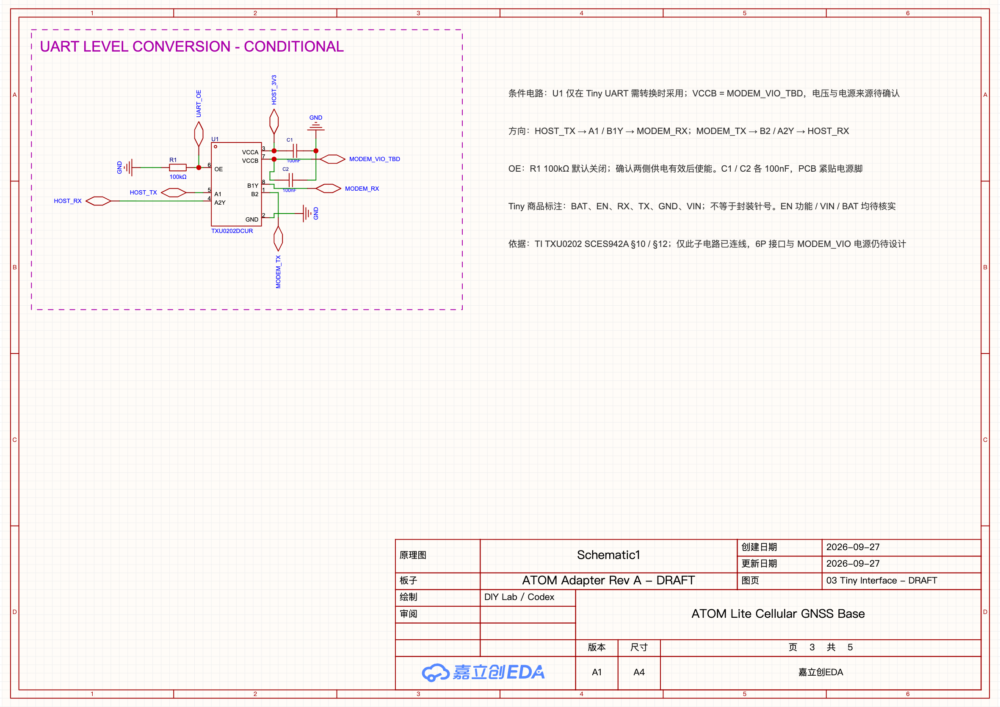

# EasyEDA A1 原理图草稿

[打开原生工程](https://pro.lceda.cn/editor#id=247f2261614c4e20861e8a96a79cb7ba)

只使用 Codex 内置浏览器中的 EasyEDA Pro Web，工程写入通过 typed CLI 和参数文件完成。
Tiny 页已实现 **UART 电平转换候选子电路**，五个功能页已添加中文设计说明。
备注采用深灰色普通文字，不加 zone 边框；Tiny 页的备注放在电路右侧。
项目仍为 `idea`，完整供电、连接器、PCB 和实机验证尚未完成。

**后续整板目标已收敛为一张 A4**，依据[首版产品目标和 BOM](../../docs/rev-a-product-and-bom.md)。
本目录的五页 A1 是历史草稿，本轮尚未执行页面合并；旧 G23/G33 GNSS 备注由现有 Grove G26/G32 方案替代。
[选型库身份](selection-a2-library.json)仅是 read-only 查询结果，新器件没有放入原理图。



## Tiny 图片参考素材

已准备 [尺寸与接口观察示意](../../docs/assets/tiny-dimensions-pinlabels.svg) 和
[图片摆放计划](tiny-reference-images.plan.json)，**尚未导入原生原理图**。
实测约 20 × 20 mm 与商品标称 20 × 19 × 6 mm 分别注明来源；6P 节距 2.54 mm 为用户报告。
图中 A–F 只索引正面右侧从上到下的 BAT、EN、RX、TX、GND、VIN，不作为正式封装针号。

用户原始正反面照片、商品尺寸图与 FPC 天线图原样保存在忽略的 `local/tiny-reference-images/`。
这些原图未复制进 Git；公开 SVG 是自行绘制的观察示意，不包含设备识别号码或第三方图片。
图片导入目标为 Tiny 页下半部，独立于电气符号；原生 A1 电路尚未改变。

当前 CLI/daemon/选中 Connector 均为 1.8.0，Web 4.1.60。官方 API 索引提供
`sch_PrimitiveObject.create(content, startX, startY, width, height, rotation, mirror, fileName)`，
但已安装的 typed action 目录没有原理图图片/内嵌对象创建动作。PCB 的丝印 SVG 导入不能代替它。
本次未绕过该缺口调用原始 JS。原生导入、坐标语义、保存重开及图片持久化均未验证。
已检查 SVG/JSON 可解析、六脚文字、原图字节一致性与计划边界；PNG 预览文字清晰，无裁切。

## 已实现的子电路

| 器件 | 选型与用途 |
| --- | --- |
| U1 | TXU0202DCUR / C5186957，两个固定方向通道，条件式 UART 电平转换 |
| C1、C2 | CC0603KRX7R9BB104 / C14663，100 nF，分别为 VCCA、VCCB 去耦 |
| R1 | 0603WAF1003T5E / C25803，100 kΩ，OE 默认下拉关闭 |

引脚映射依据 [TI TXU0202 数据手册](https://www.ti.com/lit/ds/symlink/txu0202.pdf)
SCES942A 的引脚定义、§10 UART 应用及 §12 去耦建议，并与原生库实例八个引脚逐一对应：

- `HOST_TX → A1(5) → B1Y(8) → MODEM_RX`。
- `MODEM_TX → B2(1) → A2Y(4) → HOST_RX`。
- `VCCA(3) = HOST_3V3`，`VCCB(7) = MODEM_VIO_TBD`，`GND(2) = GND`。
- `OE(6) = UART_OE`，通过 R1 接地；两侧供电有效后由主机使能。

`MODEM_VIO_TBD` **没有已设计的电源来源或确定电压**。先取得 Tiny 的实际 UART 电压和板内转换资料，
再决定采用或省去 U1。当前 6P 上没有已验证的 VIO 输出，不能把 VIN/BAT 当作这个参考电源。
此页没有 Tiny 连接器，也没有把商品图标签当作封装针号；电源和信号端口表示待接入的边界。
G21 控制 OE 仅为主机资源提案，不构成已完成的 GPIO 接线。

## 五页内容

| 页面 | 当前实现 |
| --- | --- |
| 01 Power | USB-C 受电、分路、防倒灌、峰值依据和待确认项；尚无电源电路 |
| 02 ATOM Host | G19/G22 用于 4G、G23/G33 用于 GNSS 的提案；标明 I2C 冲突和待核针序 |
| 03 Tiny Interface | 四器件 UART 候选电路；标明转换方向、VIO 来源待定、OE 默认关闭和去耦 |
| 04 GNSS Interface | 独立 UART、Grove 线色、供电与电平区别、官方旧版 PDF 差异 |
| 05 Test Points | 测试点、上电、发射负载、定位上报和试产计划；尚无测试焊盘 |

供电、EN、GPIO 和连接器尚未冻结；这些备注不是可以直接照接的整板接线表。
两路 UART 的 TX 不并联。原外壳、朝下排针与底壳天线孔保持原基线。

## 参数与证据

- [uart-a1.layout-input.json](uart-a1.layout-input.json)：连接目标、器件所有权、实测引脚/位号几何及布局约束。
- [uart-a1.composition.json](uart-a1.composition.json)：由 `sch lib-layout` 求得的局部电路，附最终图签字段。
- [annotations/](annotations/)：五页普通文字的内容、位置和样式参数。
- [annotate-a1.apply.json](annotate-a1.apply.json)：原生备注写入及图签队列，执行时指定当次窗口。
- [project-state.json](project-state.json)：工程 UUID、对象数、验证范围与本机快照摘要。
- [library-candidates.json](library-candidates.json)：早期三款 TI 候选库身份，不代表全部已使用。
- `local/`：原始回包、失败日志、受保护队列、原生导出和图片，忽略 Git。

原生图框 SVG 解析得到 A4 内框 `(10,10)…(1160,815)`，图签占位 `(460,10)…(1160,190)`。
原理图单位为 raw（0.01 inch），y 向上，网格 5。器件坐标由实测几何与布局器生成，没有猜测封装焊盘。

### 重算与执行

从仓库根目录运行。每次先用 `easyeda health` 核对工程、浏览器宿主及窗口版本。
当前机器仍有一个 1.6.0 旧连接器会话，本轮设计写入均固定到 1.8.0 窗口。
不要仅以工程 UUID 自动路由，也不要将窗口 ID 固定进长期源文件。

```sh
easyeda sch lib-layout --from projects/atom-lite-cellular-gnss-base/hardware/easyeda/uart-a1.layout-input.json --out projects/atom-lite-cellular-gnss-base/hardware/easyeda/local/recomputed.json
easyeda sch compose --from projects/atom-lite-cellular-gnss-base/hardware/easyeda/uart-a1.composition.json --out projects/atom-lite-cellular-gnss-base/hardware/easyeda/local/plan.json
easyeda apply projects/atom-lite-cellular-gnss-base/hardware/easyeda/annotate-a1.apply.json --dry-run
```

布局重算输出不含图签设置，沿用已提交 composition 的 `titleBlock`。实际电路 Apply 必须用
当前页的 fresh `sch list`（identity/pins/bbox/wires/page-primitives）重新生成受保护队列。
不能重放旧测量、旧 primitive ID 或 A0 scaffold 队列。

1.8.0 没有独立的文字写入命令。备注队列组合现有 typed 能力：用 frame 工具建立并回读文字样式，
捕获该次返回的矩形 ID，再仅删除这些矩形。最终保留普通文字，电路图元不在删除范围。
内部 frame 记录保留创建收据，最终无框状态通过实际 texts/rectangles 验收，不运行旧 `frame check`。
修改备注参数时同步重生成队列，不能只运行其中建立框的一步。

## 验证边界与回退

四器件共 14 个引脚的网络与目标一致，原生回读为 10 个合并后的导线图元、3 个地标记、7 个端口。
外围直连与导线树检查通过；有一处已核实无接点的内部交叉。
首次严格门禁发现图签未填，后续补齐；最终官方 DRC 返回 4 个 warning，只有聚合数量，尚未取得逐项原因。
局部连通检查不能替代完整板级设计或消除官方警告。

五页均执行保存、重开和 fresh 回读；最终备注去框后另行核对文字、矩形及电路不变性。
实际结果见[验证记录](../../docs/validation.md)。没有进行 PCB 导入、布线、制造导出、上电或固件测试。
本机原生 `.epro2` 是备份，ZIP 完整性检查不等于导入恢复测试。

回退保留 A0 框架备份和本轮前后快照。撤回本轮时仅处理本轮创建的器件、电路和文字，
不删除整个工程或其他项目；外壳基线不受影响。
