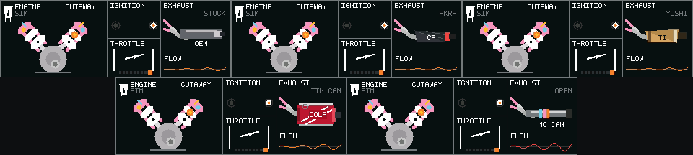

# EV Engine Sound

面向 ESP32-S3 的实时发动机声浪模拟器，可作为电瓶车、模型车或交互装置的声音外设。

项目使用独立 C 音频核心，按四冲程 720° 点火周期实时合成声音，并通过 LVGL 显示
气缸、活塞、连杆、曲轴和逐缸点火动画。声音包含启动、怠速、给油、收油、限转和
音量渐变，不依赖音频采样文件、网络或云服务。

发动机与排气可独立选择。当前提供原厂、Akrapovič 风格、Yoshimura 风格、可乐罐和
直通（完全移除消声器）5 种程序化排气音色。品牌风格名称仅描述非官方调音方向；项目
没有使用厂商录音、声纹数据或官方授权素材，也不宣称复刻具体产品。

目前提供 18 种发动机配置，覆盖 1/2/3/4/5/6/8/10/12 缸，包括 270° 双缸、
T-Plane 三缸、直列发动机、V 型发动机、水平对置六缸、平面与十字曲轴 V8、V10
和 V12，最高模拟转速 16000 RPM。

> 这是程序化声浪原型，参数为设计值，不对应特定车型的实测声纹，也不运行桌面版
> Engine Simulator 的热力学模型或 `.mr` 文件。

## 支持硬件

当前立创实战派固件版本为 **0.3.0**，对应官方 Engine Simulator 视觉语言、首页点击
循环切换发动机/排气和五种程序化排气音色。

| 板型 | 显示与控制 | 音频 | 状态 |
| --- | --- | --- | --- |
| M5Stack StickS3 K150 | 240×135 ST7789、A/B 按键 | ES8311 + 板载扬声器 | 已烧录验证 |
| 立创实战派 ESP32-S3 N16R8 | 320×240 ST7789、FT6336 触摸 | ES8311 + PCA9557 | 已烧录验证 |
| 历史 ESP32-S3 开发板 | 无 UI | MAX98357A | 已构建验证 |

每种硬件使用独立板级目录：

```text
firmware/config/boards/
├── m5_sticks3
├── lichuang_szp
└── legacy_esp32s3
```

## StickS3 操作

- 按住 A：启动并给油；松开后收油回怠速。
- 短按 B：切换下一种发动机。
- 长按 B：在主屏、音量和红线转速页面间切换。
- 设置页面按 A / B：减小 / 增大数值。
- 同时按 A+B：停止发动机。

默认音量为 60%。电池供电时建议保持在 75% 以下。

## 电脑试听

```sh
cmake -S . -B build -DCMAKE_BUILD_TYPE=Debug
cmake --build build -j 4
ctest --test-dir build --output-on-failure

build/render_voice inline4 stock build/inline4-stock.wav
build/render_voice twin270 akrapovic build/twin270-akrapovic.wav
build/render_voice twin270 tin_can build/twin270-tin-can.wav
build/render_voice v12 straight build/v12-straight.wav
```

每个 WAV 包含启动、渐进给油、高转、收油和停机过程，使用与固件相同的合成核心。

## 电脑预览动力总成

发动机、点火显示、排气和油门把手使用与立创实战派固件相同的 320×108、RGB565、
无堆分配渲染器。画面采用开源 Engine Simulator 的官方默认配色、机械剖面和点火环
语言，并保留来源与 MIT 许可说明；排气与触控组件为本项目重新设计。无需连接开发板
即可生成五种排气的 3 倍整数缩放预览：

```sh
cmake --build build --target render_powertrain
mkdir -p build/ui-preview
build/render_powertrain build/ui-preview
```

输出为 `powertrain-stock.ppm`、`powertrain-akrapovic.ppm`、
`powertrain-yoshimura.ppm`、`powertrain-tin_can.ppm` 和
`powertrain-straight.ppm`。整数缩放不使用插值，屏幕上的每个像素都能直接检查。
仓库还提供可直接用浏览器打开的 [`docs/ui-preview.html`](docs/ui-preview.html)：它按
320×240 实际布局显示首页，并允许点击发动机与排气按钮验证单步循环切换。

五种排气预览（从左到右、从上到下依次为原厂、Akrapovič 风格碳纤罐、Yoshimura
风格钛色罐、可乐罐和完全移除消声器）：



电脑端 1920×1080 设计母稿直接使用上游官方截图中的发动机剖面素材，先确定构图、
层级和排气细节；320×108 图是为 ESP32 RGB565 屏幕重新光栅化的落板版本：


上游参考、固定提交和完整许可见
[`docs/third-party/engine-sim.md`](docs/third-party/engine-sim.md)。

## 构建 StickS3 固件

项目使用 ESP-IDF 5.5。在 `firmware/` 目录执行：

```sh
. "$IDF_PATH/export.sh"

idf.py -B build-sticks3 \
  -DSDKCONFIG=build-sticks3/sdkconfig \
  '-DSDKCONFIG_DEFAULTS=sdkconfig.defaults;config/boards/m5_sticks3/sdkconfig.defaults' \
  -DEV_BOARD=m5_sticks3 \
  -DIDF_TARGET=esp32s3 build
```

烧录前请核对板型和 Flash 容量。其他板型只需替换构建目录、`EV_BOARD` 和对应的
`sdkconfig.defaults` 路径。

## 串口控制

```sh
python tools/console.py /dev/cu.YOUR_DEVICE --log build/serial.log
```

常用命令：

```text
profile v12
exhaust yoshimura
volume 60
redline 14000
start
throttle 35
rpm 4000
status
stop
```

排气参数名为 `stock`、`akrapovic`、`yoshimura`、`tin_can`、`straight`。立创实战派
首页只展示官方视觉语言的发动机剖面、逐缸点火环、当前排气和独立油门把手；点击
`ENGINE · TAP NEXT` 或
`EXHAUST · TAP NEXT` 即可循环切换下一个发动机或排气，不使用滑动手势。可乐罐显示
为带 `COLA` 字标、拉环和银色卷边的红色饮料罐。StickS3 长按 B 可轮换到排气设置页。

完整的板级引脚、交互说明和验证记录见：

- [StickS3 适配说明](docs/sticks3.md)
- [LVGL 界面说明](docs/lvgl-ui.md)
- [项目介绍与预览素材索引](docs/project-preview.md)
- [验证记录](docs/validation.md)

车辆电源和油门、速度或 CAN 信号需要经过匹配的降压、隔离与电平保护后再接入。
