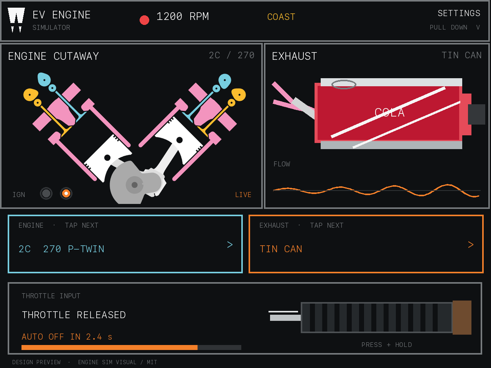
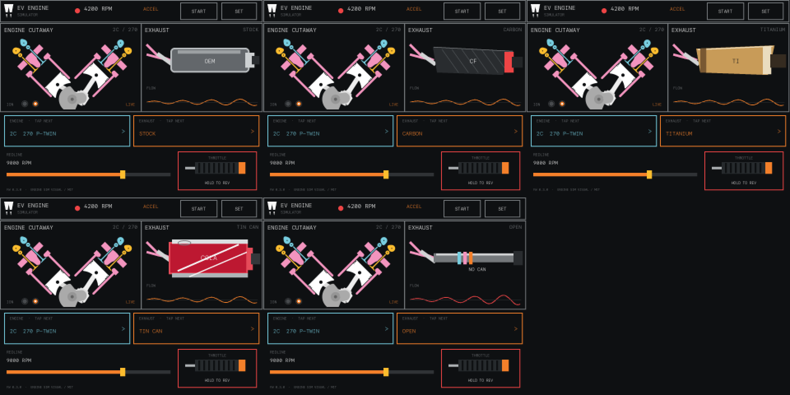
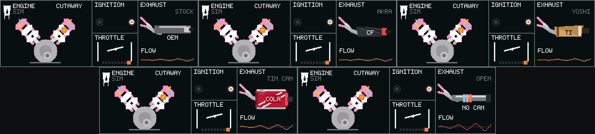
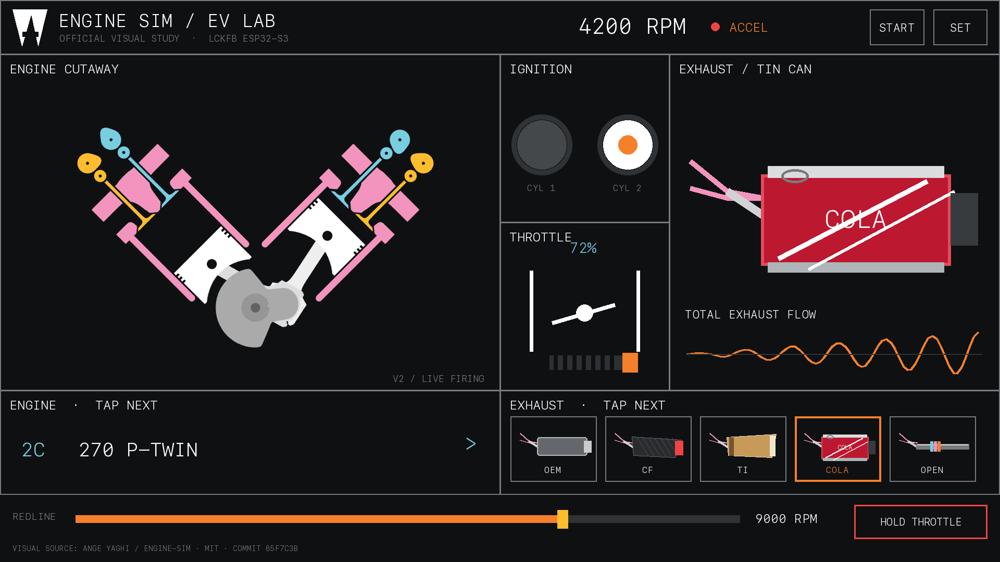

# EV Engine Sound

面向 ESP32-S3 的实时发动机声浪模拟器，可作为电瓶车、模型车或交互装置的声音外设。

项目使用独立 C 音频核心，按四冲程 720° 点火周期实时合成声音，并通过 LVGL 显示
气缸、活塞、连杆、曲轴和逐缸点火动画。声音包含启动、怠速、给油、收油、限转和
音量渐变，不依赖音频采样文件、网络或云服务。

发动机与排气可独立选择。当前提供原厂、Akrapovič 风格、Yoshimura 风格、可乐罐和
直通（完全移除消声器）5 种程序化排气音色。品牌风格名称仅描述非官方调音方向；项目
没有使用厂商录音、声纹数据或官方授权素材，也不宣称复刻具体产品。

目前提供 18 种发动机配置，覆盖 1/2/3/4/5/6/8/10/12 缸，包括 270° 双缸、
T-Plane 三缸、直列发动机、V 型发动机、水平对置六缸、平面与十字曲轴 V8、V10
和 V12，最高模拟转速 16000 RPM。

> 这是程序化声浪原型，参数为设计值，不对应特定车型的实测声纹，也不运行桌面版
> Engine Simulator 的热力学模型或 `.mr` 文件。

## 自研 PCB 方向（规划中）

计划设计一块共用声浪核心板，支持 AUX 线电平输出、蓝牙 A2DP 音频发射、外接电子
油门手把和电池模块。车载版首个适配目标为 2026 款小鹏 X9，优先通过蓝牙向车内音响播放，
并验证 OBD 直插读取踏板数据；玩具版使用同一核心接手把、音响和电池。

OBD 用于车辆数据及可能的低压取电，声音仍经独立音频链路输出。X9 的诊断协议、
踏板数据可用性、车机蓝牙配对与休眠行为尚未核验；自研 PCB 仍处于架构阶段，
不属于现有 `hardware-verified` 范围。模块分工、接口约束和验证顺序见
[共用核心板方案](docs/shared-core-hardware-plan.md)。

特斯拉与无线 OBD/CAN 接入也纳入选型：比较车型专用线束、CANserver/Commander
Wi‑Fi 网关、BLE 与经典蓝牙适配器，以及官方云端遥测。资料不等于车型实测支持，
详见[车辆无线接入调研](docs/vehicle-input-wireless-research.md)。

### 开源与私有适配边界

声浪核心、通用控制、共用核心 PCB 和独立控制演示按开源方向维护；车型专用解码、
标定、网关设计与兼容实现保留私有，放入本项目已忽略的 `private/` 或仓库外的独立
私有仓库。公开版本应能独立构建运行。当前只有车型调研，尚无适配实现；忽略规则
不隐藏已提交历史，也不限制他人按 MIT 许可商业使用公开核心。详见
[开源与私有范围](docs/open-source-boundary.md)。

## 支持硬件

当前立创实战派固件版本为 **0.4.0**。新版把 Engine Simulator 风格发动机剖面和
排气提升为左右双主栏，首页保留发动机/排气点击循环选择；按住底部油门即启动，松开
后收油并在默认 3 秒无操作时自动熄火。音量、红线和自动熄火时间收进顶栏下拉菜单。

| 板型 | 显示与控制 | 音频 | 状态 |
| --- | --- | --- | --- |
| M5Stack StickS3 K150 | 240×135 ST7789、A/B 按键 | ES8311 + 板载扬声器 | 已烧录验证 |
| 立创实战派 ESP32-S3 N16R8 | 320×240 ST7789、FT6336 触摸 | ES8311 + PCA9557 | v0.3.0 已实机验证；v0.4.0 待设备重新枚举后烧录 |
| 历史 ESP32-S3 开发板 | 无 UI | MAX98357A | 已构建验证 |

### 蓝牙音频外放（选型中）

当前固件没有蓝牙音频输出。ESP32-S3 虽有 Bluetooth LE，但车载音乐系统、普通蓝牙
音箱和耳机通常需要 Bluetooth Classic A2DP Source；不能仅通过打开板载 BLE 实现。
已核验的候选有运行 A2DP Source 固件的原版 ESP32 开发板，以及刷入 Audio Transceiver
固件的 Microchip BM83SM1-00TA。成品 AUX 发射盒还需要先确认线电平输出，不能直接接
本项目的扬声器功放端。外形、协议角色与官方资料见
[A2DP Source 选型笔记](../../docs/research/bluetooth-a2dp-source-selection.md)。

尚未确定发射硬件、接线、供电和配对交互；也没有蓝牙固件、车机或耳机实测。因此本项
不计入现有 `hardware-verified` 范围。后续验收需覆盖音频采样率转换、油门到出声延迟、
断连重连、持续运行时的音频/任务栈/心跳，以及目标车机的 A2DP 接收能力。

每种硬件使用独立板级目录：

```text
firmware/config/boards/
├── m5_sticks3
├── lichuang_szp
└── legacy_esp32s3
```

## 立创实战派界面与操作

主界面只展示发动机剖面、逐缸点火、当前排气和一只实体感油门把手，不再放置独立的
开关机或菜单按钮。点击蓝色发动机区或橙色排气区会前进一项并在末尾循环；选择不是
横滑列表，因此戴手套或单手操作时也容易命中。


- **启动与给油：**按住底部油门区，固件自动启动并将油门拉到 100%；松手立即回到
  0%，发动机进入收油和怠速阶段。
- **自动熄火：**零油门且转速回落到 0 后开始倒计时，默认 3.0 秒；到时自动停止音频
  和功放输出。倒计时会在油门区显示，不需要额外的关闭按钮。
- **快速设置：**从顶栏向下拖出菜单，拖动音量、红线转速或自动熄火等待时间；顶栏
  和设置区停止触碰 5 秒后菜单平滑收回，也可以向上拖动关闭。下方发动机、排气和
  油门操作不重置菜单倒计时。三个值松手后立即生效。
- **循环选择：**点击 `ENGINE · TAP NEXT` 或 `EXHAUST · TAP NEXT`。原厂、碳纤、
  钛色、可乐罐和直通五种排气都有独立轮廓与程序化音色。

| 下拉快速设置 | 松开油门后的自动熄火倒计时 |
| --- | --- |
|  |  |

以上是 1280×960 电脑设计母稿，用于讨论对齐、文字和层级，并非整屏固件渲染。
设计稿与当前 LVGL 实现的字体、控件样式和机械细节存在差异，详见
[设计与实现约定](docs/ui-implementation-contract.md)。下图是五种排气的 320×240
设计预览；可乐罐包含拉环、卷边、白色斜带和通用 `COLA` 字标，品牌风格预设不复制厂商 Logo。



## StickS3 操作

- 按住 A：启动并给油；松开后收油回怠速。
- 短按 B：切换下一种发动机。
- 长按 B：在主屏、音量和红线转速页面间切换。
- 设置页面按 A / B：减小 / 增大数值。
- 同时按 A+B：停止发动机。

默认音量为 60%。电池供电时建议保持在 75% 以下。

## 电脑试听

```sh
cmake -S . -B build -DCMAKE_BUILD_TYPE=Debug
cmake --build build -j 4
ctest --test-dir build --output-on-failure

build/render_voice inline4 stock build/inline4-stock.wav
build/render_voice twin270 akrapovic build/twin270-akrapovic.wav
build/render_voice twin270 tin_can build/twin270-tin-can.wav
build/render_voice v12 straight build/v12-straight.wav
```

每个 WAV 包含启动、渐进给油、高转、收油和停机过程，使用与固件相同的合成核心。

## 电脑预览动力总成

发动机、点火显示和排气使用与立创实战派 0.4.0 固件相同的 320×108、RGB565、
无堆分配渲染器。画面采用开源 Engine Simulator 的默认配色、机械剖面和点火环语言，
并保留来源与 MIT 许可说明；排气、油门把手与触控组件由本项目重新设计。无需连接
开发板即可生成五种排气的 3 倍整数缩放预览：

```sh
cmake --build build --target render_powertrain
mkdir -p build/ui-preview
build/render_powertrain build/ui-preview
```

输出为 `powertrain-stock.ppm`、`powertrain-akrapovic.ppm`、
`powertrain-yoshimura.ppm`、`powertrain-tin_can.ppm` 和
`powertrain-straight.ppm`。整数缩放不使用插值，屏幕上的每个像素都能直接检查。
仓库还提供可直接用浏览器打开的 [`docs/ui-preview.html`](docs/ui-preview.html)：它按
320×240 实际布局演示 0.4.0 交互，可下拉顶栏、拖拽音量/红线/自动熄火设置、点击
循环切换发动机与排气，并验证按住油门自动点火、松开后倒计时熄火。浏览器页面是交互
说明工具，不是运行 ESP32 固件的仿真器；真机结论以验证记录和串口日志为准。

五种排气预览（从左到右、从上到下依次为原厂、Akrapovič 风格碳纤罐、Yoshimura
风格钛色罐、可乐罐和完全移除消声器）：



电脑端 1920×1080 设计母稿直接使用上游官方截图中的发动机剖面素材，先确定构图、
层级和排气细节；320×108 图是为 ESP32 RGB565 屏幕重新光栅化的落板版本：



上游参考、固定提交和完整许可见
[`docs/third-party/engine-sim.md`](docs/third-party/engine-sim.md)。

## 致谢上游

特别感谢 **Ange Yaghi（AngeTheGreat）** 开源
[Engine Simulator](https://github.com/ange-yaghi/engine-sim)。本项目的默认色板、机械
剖面表达、仪表框架与点火展示语言从该项目获得了重要启发，并按照 MIT License 保留
来源与许可。ESP32 固件、触控交互、五种排气对象与程序化音频由本项目重新实现。

也感谢 Engine Simulator 社区持续分享发动机结构、声浪模拟和可视化方面的知识。
品牌风格排气名称仅用于描述非官方调音方向，不代表上游作者或相关厂商参与、授权或
背书本项目。

## 构建与烧录立创实战派

项目使用 ESP-IDF 5.5。在 `firmware/` 目录执行：

```sh
. "$IDF_PATH/export.sh"

idf.py -B build-lichuang \
  -DSDKCONFIG=build-lichuang/sdkconfig \
  '-DSDKCONFIG_DEFAULTS=sdkconfig.defaults;config/boards/lichuang_szp/sdkconfig.defaults' \
  -DEV_BOARD=lichuang_szp \
  -DIDF_TARGET=esp32s3 build

idf.py -B build-lichuang -p /dev/cu.YOUR_DEVICE flash
mkdir -p build-lichuang/evidence
python3 ../tools/verify_device.py /dev/cu.YOUR_DEVICE \
  --log build-lichuang/evidence/device.log
```

烧录前用 VID/PID、USB 物理位置和描述三项核对目标板，不能只凭变化的串口编号判断。
验证脚本运行 67 秒并最终停机，原始串口日志应保存在本地忽略目录；提交文档只保留
板卡版本、固件提交、供电方式、持续时间、验收条件和脱敏摘要。

## 构建 StickS3 固件

同样在 `firmware/` 目录执行：

```sh
. "$IDF_PATH/export.sh"

idf.py -B build-sticks3 \
  -DSDKCONFIG=build-sticks3/sdkconfig \
  '-DSDKCONFIG_DEFAULTS=sdkconfig.defaults;config/boards/m5_sticks3/sdkconfig.defaults' \
  -DEV_BOARD=m5_sticks3 \
  -DIDF_TARGET=esp32s3 build
```

烧录前请核对板型和 Flash 容量。其他板型只需替换构建目录、`EV_BOARD` 和对应的
`sdkconfig.defaults` 路径。

## 串口控制

```sh
python tools/console.py /dev/cu.YOUR_DEVICE --log build/serial.log
```

常用命令：

```text
profile v12
exhaust yoshimura
volume 60
redline 14000
start
throttle 35
rpm 4000
status
stop
```

排气参数名为 `stock`、`akrapovic`、`yoshimura`、`tin_can`、`straight`。立创实战派
首页只展示官方视觉语言的发动机剖面、逐缸点火环、当前排气和独立油门把手；点击
`ENGINE · TAP NEXT` 或
`EXHAUST · TAP NEXT` 即可循环切换下一个发动机或排气，不使用滑动手势。可乐罐显示
为带 `COLA` 字标、拉环和银色卷边的红色饮料罐。StickS3 长按 B 可轮换到排气设置页。

完整的板级引脚、交互说明和验证记录见：

- [StickS3 适配说明](docs/sticks3.md)
- [LVGL 界面说明](docs/lvgl-ui.md)
- [UI 开发模式与 SquareLine 自动化调研](docs/ui-development-research.md)
- [项目介绍与预览素材索引](docs/project-preview.md)
- [立创开源七周年活动参与方式与准备清单](docs/oshwhub-seventh-participation.md)
- [验证记录](docs/validation.md)

车辆电源和油门、速度或 CAN 信号需要经过匹配的降压、隔离与电平保护后再接入。
