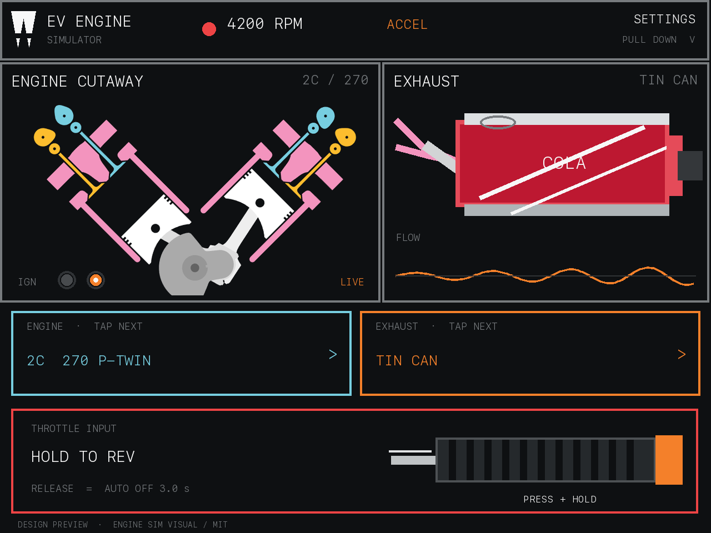
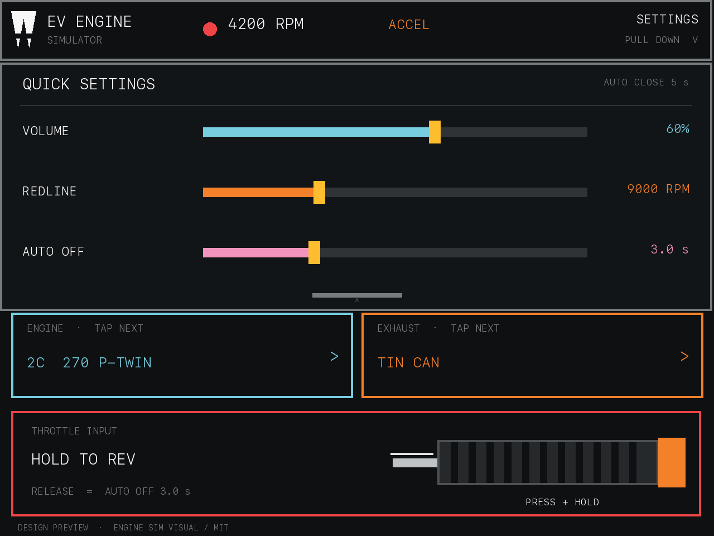

# 立创实战派 LVGL 界面

0.4.0 使用 320×240 横屏单页界面。设计目标是让发动机、排气和油门始终处于同一视线，
并把低频设置隐藏在顶栏下拉菜单中，单手即可完成主要操作。

## 主界面

- 顶栏只显示项目标识、实时 RPM、运行阶段和 `SETTINGS · PULL DOWN` 提示，没有
  `START`、`STOP` 或菜单按键。
- 172 px 左栏显示发动机剖面和逐缸点火，148 px 右栏显示选中排气及实时流量波形。
  两栏共用 320×108 RGB565 画布，不展示摩托车车身、车轮或车架。
- `ENGINE · TAP NEXT` 与 `EXHAUST · TAP NEXT` 是互相独立的循环按钮；每次点击
  只前进一项，到末尾后回到第一项。这里不使用滑动、惯性或隐藏列表。
- 发动机剖面的白色活塞、灰色连杆/曲柄、粉色气缸、蓝黄气门机构、点火环和燃烧闪光
  遵循 MIT 许可 Engine Simulator 的视觉语言。固定上游版本和完整许可见
  [`third-party/engine-sim.md`](third-party/engine-sim.md)。
- 右栏的原厂、碳纤、钛色、`TIN CAN` 和 `NO MUFFLER` 使用不同几何轮廓。可乐罐有
  红色罐身、银色卷边、拉环、白色斜带与通用 `COLA` 字标；没有复制排气厂商 Logo、
  产品图或 CAD。
- 底部 310×47 px 油门区是唯一的启停/油门入口。按住时自动启动并给 100% 油门；
  松开时立即回到 0%，进入 `COAST`。零油门且转速回到 0 后才开始自动熄火倒计时，
  默认 3.0 秒，到时停止发动机并关闭可控功放输出。

## 下拉快速设置

从顶栏向下拖动可覆盖发动机/排气画布，向上拖回则关闭。菜单提供三个滑块：

| 设置 | 范围 | 默认值 | 应用时机 |
| --- | --- | --- | --- |
| 音量 | 0–100% | 60% | 松开滑块后立即应用 |
| 红线 | 当前发动机怠速 + 500 至 16000 RPM | 随发动机配置 | 松开滑块后立即应用 |
| 自动熄火 | 1.0–8.0 秒 | 3.0 秒 | 松开滑块后立即应用 |

抽屉拖动、三个滑块、发动机/排气点击以及油门按下/松开都产生 `TOUCH` 日志，动作处理
随后产生 `UI_ACTION result=OK`。`UI_READBACK` 回报 `layout=dual_panel_v2`、
`selector=cycle_buttons`、`menu=pull_down`、抽屉状态和自动熄火时间，便于串口验收。

## 渲染与触控时序

- 触控和显示定时器为 16 ms，动力总成目标更新周期为 33 ms。这些是调度目标，不是
  “实测 60/30 FPS”的声明；实机刷新率只能由串口渲染计数和时间差计算。
- 循环按钮先记录旧值和新值，再分发动作。文字、样式和滑块只在值变化时更新；发动机
  静止时停止无意义重绘，抽屉展开时不重绘其下方机械画布。
- 69120 B 静态 RGB565 画布避免渲染循环分配堆；两块 40 行 DMA 缓冲不会占用任务栈。
- LVGL 任务固定在 core 0、优先级 4，显式栈大小 10240 B；心跳日志持续回报其高水位。

## 声音过渡

启动采用 550 ms 平滑点火包络和短促的程序化启动机声；油门负载为 85 ms 上升 / 190 ms
释放，飞轮响应为 240 ms 上升 / 480 ms 下降，增益为 45 ms 上升 / 75 ms 释放。所有
声音都实时合成，不使用录音采样。

发动机配置和排气音色相互独立。五种排气通过共振频率/衰减、脉冲与噪声比例、低通、
驱动和收油余韵改变听感，不在音频内环增加采样文件或堆分配。Akrapovič 与 Yoshimura
只是不受厂商认可的描述性预设名，不是实测复刻或官方声图。

| Cylinders | Dependent crank/layout choices |
| --- | --- |
| 1 | `360 CRANK` |
| 2 | `180 P-TWIN`, `270 P-TWIN`, `360 P-TWIN`, `45 V-TWIN`, `90 V-TWIN` |
| 3 | `120 EVEN`, `270 T-PLANE` |
| 4 | `EVEN INLINE`, `CROSSPLANE` |
| 5 | `INLINE FIVE` |
| 6 | `INLINE SIX`, `60 V-SIX`, `FLAT SIX` |
| 8 | `FLATPLANE V8`, `CROSSPLANE V8` |
| 10 | `72 V-TEN` |
| 12 | `60 V-TWELVE` |

UI 控制会关闭远程链路超时；之后任一串口控制命令会重新启用两秒串口看门狗。LVGL
刷新定时器只读取加锁状态快照，不直接操作音频引擎。配置变化还会输出
`UI_SYNC mode=cycle_buttons`，其中同时包含当前发动机与排气。

## 硬件路径

- ST7789：SPI2，GPIO41 SCLK、GPIO40 MOSI、GPIO39 DC，40 MHz，mode 2。
- LCD 片选：PCA9557 地址 0x19 的 bit 0，低电平有效。
- 背光：GPIO42，LEDC 5 kHz、50% 占空比；静态 GPIO 电平不能稳定点亮此板升压电路。
- FT6336/FT5x06 触控：I2C0、GPIO1/GPIO2、地址 0x38；横屏坐标交换 XY 并镜像 X。
- LVGL 任务：core 0、优先级 4、显式 10240 B 栈；心跳通过 `stack_lvgl` 回报高水位。
