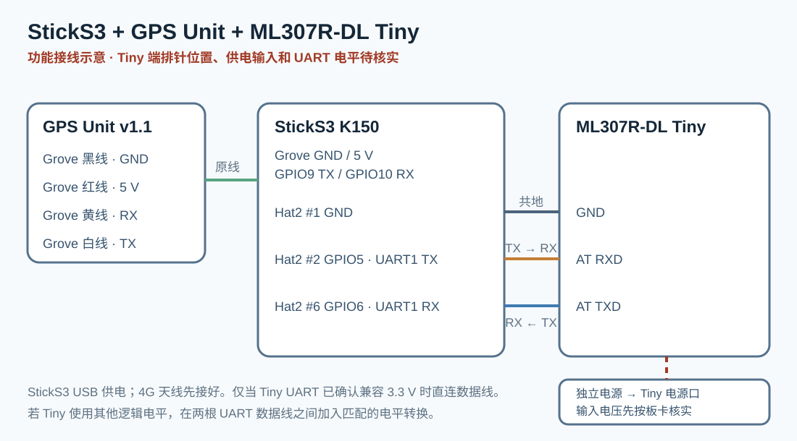

# StickS3 GPS → MotoBox

StickS3 K150 reads Unit GPS v1.1 and uploads MotoBox telemetry through an ML307R-DL Tiny 4G board.
The ESP32 validates the MQTT TLS certificate and hostname, then displays and speaks a server-generated
one-time binding code. A short 4G bench run verified GPS input, cellular time, TLS/WSS MQTT,
QoS 1 acknowledgements and MotoBox ingestion. Long-run stability, outage recovery, signal level,
power and outdoor movement remain open. Earlier Wi-Fi verification is recorded separately in
[validation](docs/validation.md).

The project remains a `prototype`. The earlier Wi-Fi configuration passed indoor connectivity,
offline recovery, mini-program binding and a stationary outdoor GNSS fix. The 4G configuration
has passed a short integrated bench run and still needs the acceptance checks below.

The first public demonstration uses a platform-managed device account. MotoBox broker access is issued
separately; cloning this repository does not automatically create a cloud device or MQTT credential.

## 中文简介：一套设备到微信端的定位 Demo

外接 **Unit GPS v1.1** 接收卫星信号，**StickS3** 校验定位数据并显示状态，
由 **ML307R-DL Tiny 核心板**经 4G 和 MQTT TLS 上传到 **MotoBox**。微信小程序提供账号登录、
设备绑定以及位置/轨迹查看与分享入口。需要已激活且可用的物联网卡、分别满足负载的电源、
设备专属 MotoBox 凭据和小程序访问资格。

4G 实机已在室内完成 GPS 数据接收、蜂窝授时和 MotoBox 状态帧入库；两分钟断网补传、
移动轨迹、定位精度与微信位置分享完整链路仍待验收。先前 Wi-Fi 固件的验证单独记录。
从下面的图解手册入门，再按本页步骤构建运行；精确版本与实测范围以[验证记录](docs/validation.md)为准。

## Illustrated user manual / 中文图解手册

[中文图解使用手册](docs/manual/README.md)记录 2026-09-24 的 Wi-Fi 版本；其热点接线和屏幕图
不适用于本 4G 固件。当前接线和构建步骤以本页为准。图稿为示意图，不是实机照片。

该手册由仓库独立技能 `m5-product-manual` 组织。想为自己的 M5 项目制作类似文档，可阅读
[技能介绍、灵感来源与调用示例](../../docs/m5-product-manual.md)。

## Hardware

| Item | Exact model/revision | Quantity | Notes |
| --- | --- | ---: | --- |
| Controller | M5Stack StickS3 K150 | 1 | ESP32-S3-PICO-1-N8R8, 3.3 V GPIO |
| GNSS | M5Stack Unit GPS v1.1 / U032-V11 | 1 | ATGM336H-6N / AT6668, 115200 8N1 |
| Cellular | ML307R-DL Tiny 核心板（芯引者购买记录） | 1 | 需核对实物丝印、AT 固件和 UART 电平 |
| SIM / antenna | 中国大陆物联网卡与匹配的 4G 天线 | 1 each | 测试前核对激活、流量、频段及天线接头 |
| Cable | HY2.0-4P Grove cable | 1 | Included with the GNSS Unit |
| Power | StickS3 USB + Tiny 独立 5 V 支路，或一只足额电源分两路 | 1–2 | Tiny 单支路至少 2 A；共用电源先按 5 V/3 A 预算并实测 |

Unit GPS 文档给出 5 V 下典型 31.64 mA。StickS3 官方给出 Grove 5 V 负载能力约 0.38 A；
其 [EXT_5V_EN 说明](https://docs.m5stack.com/en/core/StickS3) 指出 Grove 和 Hat2 EXT_5V
共用输出模式。该接口不能作为尚未测得发射峰值的 4G 供电支路。

## Wiring and power

Connect the keyed Grove cable directly. Looking at the documented pin order:

| Grove wire | Unit GPS v1.1 | StickS3 |
| --- | --- | --- |
| Black | GND | GND |
| Red | 5 V | 5 V output |
| Yellow | UART RX | GPIO9 / host TX |
| White | UART TX | GPIO10 / host RX |

The firmware enables the StickS3 M5PM1 5 V boost. Once enabled, do not also feed 5 V into the Grove red
wire. Confirm the connector key and labels before power-on; ESP32-S3 GPIO is not 5 V tolerant.

### ML307R-DL Tiny 接线



GPS 仍占用 Grove 的 GPIO9/10；固件将 GPS 设为 UART2。4G 使用 UART1，StickS3
Hat2 排针位置以 [M5Stack StickS3 官方 PinMap](https://docs.m5stack.com/en/core/StickS3) 为依据：

用户提供的芯引者商品图显示：**金属屏蔽罩文字正向、六孔排针在右侧时，从上到下依次是
BAT、EN、RX、TX、GND、VIN**。新提供的接口表则从底部 **VIN=引脚 1** 向上编号，
依次为 GND=2、TXD=3、RXD=4、EN=5、BAT=6。下表同时给出两种编号，接线时优先认实物丝印：

| StickS3 Hat2 | StickS3 信号 | Tiny 实物信号 | 商品图从上数 | 接口表引脚序号 |
| --- | --- | --- | --- | --- |
| 1 脚 | GND | **GND**，共地 | 第 5 孔 | 2 |
| 8 脚 | GPIO7 / UART1 TX | **RX / RXD** | 第 3 孔 | 4 |
| 4 脚 | GPIO4 / UART1 RX | **TX / TXD** | 第 4 孔 | 3 |

接口表标称 VIN 为 **5–16 V**、TXD/RXD 为 **3.3 V 电平**；这是用户提供的板卡资料，
但用户首次测得 Tiny TXD 空闲约 **3.6 V**，后来怀疑读数不准；电平尚未复测。
短窗实机试验以直连方式在 GPIO7/4 上完成 AT、注册和 TCP，但这不能代替接口
电平确认。长期使用前应复测 TXD 高电平，并按实测值决定是否加入电平转换。
Tiny 的准确 PCB 版本和波形仍待确认。
Tiny 的 VIN 用独立 5 V/至少 2 A 供电支路，电源地与 StickS3 共地；不要从 Hat2
EXT_5V 或 Grove 红线给 4G 模组供电。若要共用一只电源，先以 5 V/至少 3 A 为台架
预算，从电源端分两路，分别接 StickS3 Hat2 **15 脚 5V_IN（输入）**和 Tiny **VIN**，
电源地接 StickS3 Hat2 **1 脚 GND**及 Tiny GND。5V_IN 不是可控输出；接外部
5V_IN 时，先不要同时接 USB 电源，直到核对具体供电路径及防反灌设计。实际额定电流
仍以注册/发射峰值测量为准。接口表标 BAT 为 3.4–4.2 V 电池输入，
**不可与 VIN 同时供电**。StickS3 Hat2 **11 脚标为 BAT**；官方仅给出
250 mAh 电池容量，没有给出 Hat2 BAT 可承受的 4G 发射峰值，当前联网验证
不可从此脚给 Tiny BAT 供电。

接口表写明 EN 默认上拉至 VIN。VIN 为 5 V 时，**EN 不可直接接 StickS3 的 3.3 V GPIO**；
本阶段让 EN 保持未接，由载板默认上拉启动。后续需要软件开关时，先核对 EN 电路，再用
适合 VIN 电压的开漏/开集电极隔离驱动，并验证低电平关断及上电默认状态。仅共用
5 V 电源不会让 Tiny 随 StickS3 休眠或关机；需要可靠的同步断电时，应在 Tiny VIN
支路加入适合 4G 峰值电流、默认关断的负载开关，并先验证启动时序。

先用独立的 [AT/TCP 接入 Demo](../../demos/sticks3-ml307r-at/) 核对模组检测、注册和
数据连接，再验收本项目的 GPS 与 4G 并行运行。Tiny 实物丝印、供电电压和 UART 空闲
电平确认后，再进行上电验证。

## Configure, build and flash

Install ESP-IDF 5.5.2, then create the ignored local configuration:

```bash
cd projects/m5stack-sticks3-gps-motobox/firmware
cp sdkconfig.local.defaults.example sdkconfig.local.defaults
```

Fill in the device-specific MotoBox MQTT TLS values. Keep the ML307R-DL AT firmware and active
SIM ready; the default cellular build uses MQTT over WSS/TLS on port 443 and does not start Wi-Fi.
Do not commit the local configuration. Build and
flash with both defaults files:

```bash
source ~/esp/esp-idf/export.sh
idf.py -B build \
  -DSDKCONFIG_DEFAULTS='sdkconfig.defaults;sdkconfig.local.defaults' \
  set-target esp32s3 build
idf.py -B build -p /dev/cu.usbmodemXXXX flash monitor
```

If you previously built this project under `demos/`, use a fresh build directory after the move to `projects/`;
the old CMake cache contains absolute paths. Keep your ignored local configuration when rebuilding.

The cellular build rejects empty credentials and requires `wss://` or `mqtts://`. The default
MotoBox endpoint is `wss://emqx.daboluo.cc/mqtt`; port 8883 timed out in the 2026-09-27
bench check, while the port 443 WebSocket handshake succeeded from the development computer.
The ESP32 validates the server hostname and public certificate chain for either scheme.
Cellular UDP SNTP supplies time indoors;
valid GNSS time remains another source. TLS errors leave the queue pending.

The Mandarin binding prompt and digit clips are checked in as 16 kHz mono PCM, so normal firmware builds do
not require a speech service. `firmware/tools/generate_binding_voice.py` reproduces them on macOS with the
Tingting system voice and `ffmpeg` when the wording or audio processing needs to change.

## Bind with the MotoBox mini program

1. The status page shows 4G registration/carrier, raw CSQ (0–31, 99 unknown) and queue depth;
   `GPS MODULE ONLINE` means valid NMEA
   sentences are arriving, while `FIX READY` requires a usable location. `GPS MODULE NO DATA` means the
   receiver has not sent a valid sentence in five seconds. These are independent of 4G and binding.
2. Wait for `4G UP` and `MQTT UP`. The StickS3 asks MotoBox whether this device already has an owner. If
   it is already bound, the screen shows `BIND BOUND` and does not request or announce another code. If the
   server confirms it is unbound, the StickS3 requests a six-digit one-time code, opens the binding page,
   and says “绑定验证码” followed by the six digits. `BIND CHECK` means the state has not yet been verified;
   it does not mean a new binding is required. Press A to switch between status and code pages.
3. Only if the device is unbound, open the MotoBox mini program, select **添加设备**, and enter the code spoken
   or shown by the StickS3. The code is valid for ten minutes and can be used once.
4. Open the MotoBox WeChat mini program and sign in. Its availability may be limited to the current official or
   invited experience release; use the access route supplied with the demonstration. The latest repository
   evidence only confirms an uploaded development build. It does not claim that every WeChat user can open a
   formal or experience release.
5. Optionally name the device and finish binding. The StickS3 checks binding state about every ten seconds and
   changes to `BIND BOUND` after the server confirms it. A reconnect or reboot does not require rebinding.
6. Move outdoors for the first fix. The device page distinguishes an online device waiting for a first fix from
   an offline device. After valid points arrive, open **实时位置**, **历史轨迹**, or **分享位置**.

MotoBox is the hosted companion service for this project. The firmware, protocol example and reproduction steps
are open under the repository MIT license; the hosted service and its device credentials are operated
separately.

- MotoBox website: [motobox.daboluo.cc](https://motobox.daboluo.cc/)
- MotoBox source and API contract: [github.com/zhoushoujianwork/motobox](https://github.com/zhoushoujianwork/motobox)
- This hardware project: `projects/m5stack-sticks3-gps-motobox/` in DIY Electronics with AI

## Data and offline behavior

- Topic: `vehicle/v1/{device_id}/telemetry`
- Model: `m5stack-sticks3-gps`; cellular build capabilities: `gps`, `gsm`
- `system.signal`: raw CSQ 0–31; 99 means unknown. `modules.gsm` reflects data readiness.
- `ext.cell_model`, `cell_registered`, `cell_data`, `cell_reconnects`, `cell_sampled_ms` report diagnostic state.
- Coordinates: WGS-84; speed: km/h; device time: UTC milliseconds
- Interval: five seconds; MQTT QoS 1; retained flag off
- Valid fix: matched RMC/GGA time, at least four satellites, `0 < HDOP < 20`, age at most five seconds
- Offline queue: 120 RAM frames, oldest first; a frame is removed only after its PUBACK
- Full queue: preserve an in-flight frame, drop the oldest frame not in flight, and expose the drop count
- Restart: RAM backlog is intentionally lost in this prototype

The firmware initializes the K150's 8 MiB Octal PSRAM. The offline queue and TLS allocations use external RAM
so that display DMA buffers and FreeRTOS task stacks retain sufficient internal memory.

## Expected serial result

```text
POWER_READY lcd=on grove_5v=on pm1=0x6e
AUDIO_READY amp=off format=0x0c volume=0xbf
BINDING_VOICE_READY sample_rate=16000 task_stack=4096
GNSS_READY uart=2 baud=115200 rx=10 tx=9
MODEM_DETECTED model=ML307R-DL... uart=1 tx=7 rx=4
NETWORK_READY carrier=... csq=...
TIME_TRUSTED source=CELLULAR_SNTP ...
TLS_VERIFIED host=...
MQTT_CONNECTED uri=wss://...
BINDING_STATUS_REQUESTED msg_id=...
BINDING_STATUS bound=0
BINDING_CODE_REQUESTED msg_id=...
BINDING_CODE_READY expires_ms=...
BINDING_VOICE_START digits=6
BINDING_VOICE_DONE stack_free=...
GNSS_FIX ... sat=8 hdop=1.1 ...
MQTT_ACK seq=1 ...
HEARTBEAT gps_online=1 gps_fix=1 cell_data=1 cell_csq=... binding_known=1 bound=1 ... queue=0 dropped=0 stack_uplink=... ...
```

The binding status and code requests use `vehicle/v1/{device_id}/binding/request`; the server responds only to the authenticated
device on `vehicle/v1/{device_id}/binding/response`. The new status response requires the MotoBox backend
binding-status protocol; an older backend leaves `BIND CHECK` and the firmware ignores an unsolicited code.
Run host tests with `./tests/run.sh`. See
[cellular design and task stacks](docs/cellular-design.md) and
[validation](docs/validation.md) for the required real-device run and
the distinction between build and hardware verification.

## Sources

- [M5Stack StickS3 documentation](https://docs.m5stack.com/en/core/StickS3), accessed 2026-09-22.
- [M5Stack Unit GPS v1.1 documentation](https://docs.m5stack.com/en/unit/Unit-GPS%20v1.1), accessed 2026-09-22.
- [78/esp-ml307 component, version 3.7.5](https://github.com/78/esp-ml307), Apache-2.0; AT/TCP interface basis.
- [MotoBox protocol summary](https://github.com/zhoushoujianwork/motobox), accessed 2026-09-22.
