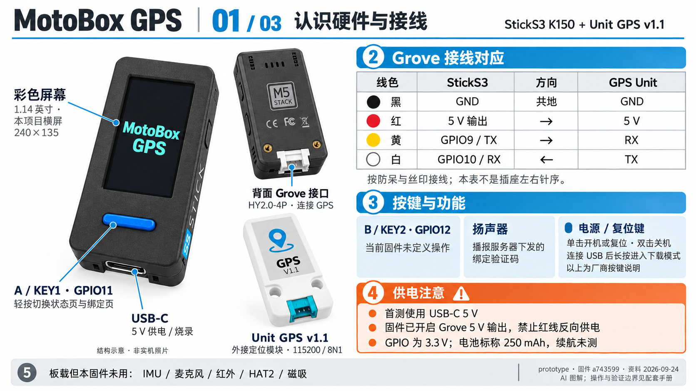
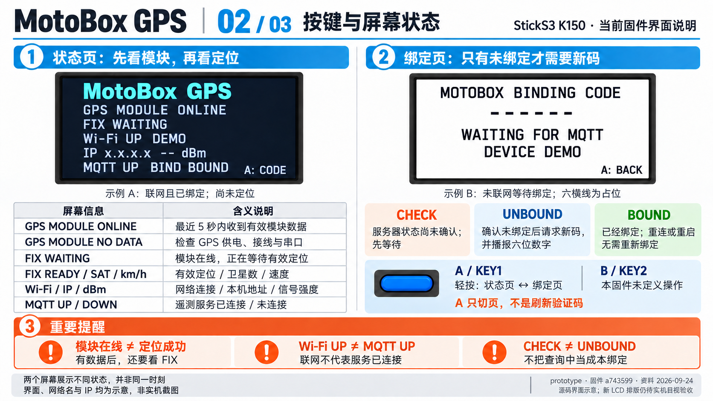
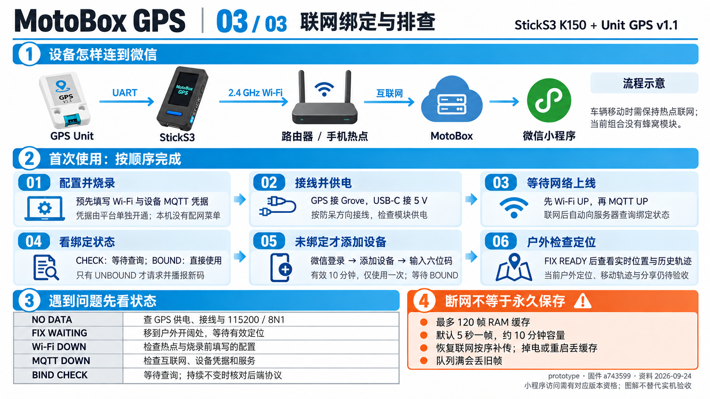
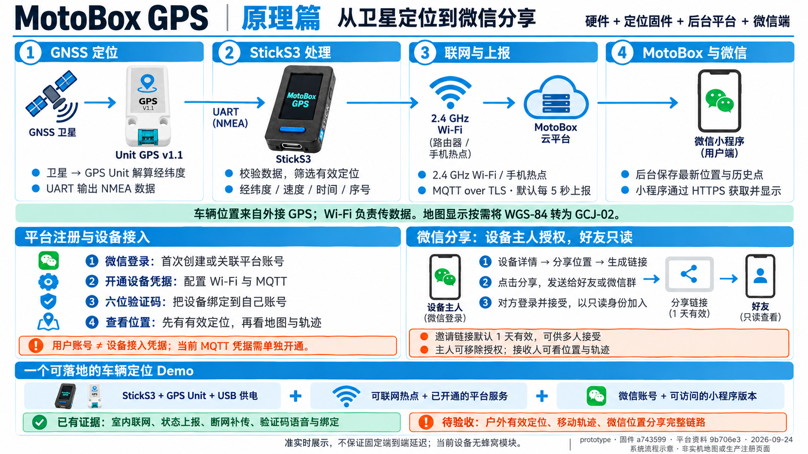

# MotoBox GPS · StickS3 图解使用手册

适用：**StickS3 K150 + Unit GPS v1.1（U032-V11）**，已提交的状态显示固件 `a743599`，资料快照 `ae261be`（2026-09-24）。平台与小程序资料版本 `9b706e3`。项目仍为 **prototype / 开发中**；制作期间其他进行中的固件改动未混入本手册。
本手册区分硬件能力、当前固件功能和实测范围。图片为 AI 图解及界面示意，完整精确说明以下文和[事实依据](facts.md)为准。

**同日版本补记（依据 `0748e80`）：** 下列四图保留 `a743599` 制作快照。后续 `fec6e12` 固件已取得户外静止定位，后台记录连续 126 帧有效 GNSS 位置；移动轨迹、定位精度与微信位置分享完整链路仍待验收。后续界面收到 GGA 而未定位时显示 `NO FIX  SAT …`，尚无 GGA 时仍显示 `FIX WAITING`。图中“户外定位待验收”是旧快照状态，当前进度以本补记及[验证记录](../validation.md)为准。

## 三页操作图解 + 技术原理篇

1. [认识硬件与接线](01-hardware.png)
2. [按键与屏幕状态](02-screen-and-controls.png)
3. [联网绑定与排查](03-setup-and-troubleshooting.png)
4. [定位原理、平台注册与微信分享](04-solution-principles.png)

## 1. 设备各部分做什么

| 部件 | 本项目中的作用 | 使用要点 |
| --- | --- | --- |
| StickS3 彩屏 | 显示 GPS 模块、定位、网络和绑定状态 | 1.14 英寸；本项目采用 240×135 横屏，固件通过按键操作。 |
| A / KEY1，GPIO11 | 切换状态页与绑定页 | 轻按一次切一页；不负责刷新验证码。 |
| B / KEY2，GPIO12 | 当前固件未定义操作 | 不把其他 M5 产品的 B 键菜单功能套用过来。 |
| 侧面电源/复位键 | 厂商定义的开关机/下载控制 | 单击开机或复位，双击关机；连接 USB 后长按至绿灯闪烁进入下载模式。此项为厂商说明，非本轮实测。 |
| 板载扬声器 | 播报“绑定验证码”和六位数字 | 仅服务器确认未绑定并发来新码后播报；已绑定后不再播新码。 |
| USB-C | 首次使用供电、固件烧录 | 使用 5 V USB 电源；内置电池标称 250 mAh，本 GPS 组合续航未测。 |
| HY2.0-4P / Grove | 接外部 Unit GPS | 使用配套防呆线，断电接线后检查丝印。GPS 不在 StickS3 内部。 |
| IMU、麦克风、红外、HAT2、磁吸 | 板载能力/结构 | 当前 GPS 固件未使用这些扩展功能。没有由此实现防盗、录音或红外遥控。 |

### 接线与供电

| 线色 | StickS3 | 方向 | Unit GPS v1.1 |
| --- | --- | --- | --- |
| 黑 | GND | 共地 | GND |
| 红 | 5 V 输出 | → | 5 V |
| 黄 | GPIO9 / TX | → | RX |
| 白 | GPIO10 / RX | ← | TX |

该表表示信号对应关系，不表示从任意插座视角看到的针脚左右顺序。插头按防呆方向接入，并核对丝印。
当前固件开启 Grove 5 V 升压输出，**不要再从 Grove 红线反向输入 5 V**；MCU GPIO 为 3.3 V，不能直连未知或 5 V 逻辑信号。
串口使用 **115200 bit/s，8N1**，不要套用旧版 Unit GPS 的默认波特率。

## 2. 看懂状态页

| 显示 | 含义 | 下一步 |
| --- | --- | --- |
| `GPS MODULE ONLINE` | 最近 5 秒内收到了有效 NMEA 语句 | 继续看 FIX 行；这还不能证明已定位。 |
| `GPS MODULE NO DATA` | 5 秒内没有有效模块数据 | 检查 GPS 接线、5 V 供电、模块版本和串口配置。 |
| `FIX WAITING` | 模块在线，尚无符合条件的有效位置 | 将 GPS 移到户外开阔处，观察后续状态；不承诺固定等待时长。 |
| `FIX READY  SAT …  … km/h` | 有效位置，后面是卫星数和速度 | 结合 MQTT 和小程序检查位置上报；户外端到端验收仍待完成。 |
| `CHECK GPS POWER / CABLE` | 当前没有有效模块数据 | 优先检查供电和连接。 |
| `Wi-Fi UP / DOWN` | 已连接/未连接预配置网络 | SSID 是设备正在使用的网络；下一行 IP 是局域网地址，dBm 是接收信号强度。 |
| `MQTT UP / DOWN` | 已连接/未连接遥测服务 | Wi-Fi UP 不代表服务可达；需要互联网、设备凭据和有效 TLS。 |
| `BIND CHECK` | 尚未确认服务器绑定状态 | 不代表需要重新绑定；等待查询结果，长时间不变时核对后端协议版本。 |
| `BIND UNBOUND` | 服务确认当前未绑定 | 等待服务器发码，并在小程序添加设备。 |
| `BIND BOUND` | 服务确认已绑定 | 重连/重启后不用重复绑定；打开自己账号中的设备。 |

绑定页显示六位码、等待时的 `------` 或绑定成功后的 `BOUND`。`A: CODE` / `A: BACK` 是切页提示。
本说明书的屏幕、网络名和 IP 都是示意/占位，不提供实际验证码；没有屏幕倒计时或扫码入口。左右屏幕用于解释两个独立状态，不代表同一台设备在同一时刻的状态。

## 3. 首次配置和绑定

1. **准备固件与服务权限。** 首次烧录前按[项目构建说明](../../README.md#configure-build-and-flash)填写本地配置中的 Wi-Fi/热点和设备专属 MQTT TLS 凭据。仓库克隆不会自动创建服务账号。当前固件没有 AP、蓝牙或扫码配网菜单。
2. **准备网络并上电。** 打开已配置的 2.4 GHz Wi-Fi/热点，确保它能访问互联网。接好 GPS 后用 USB-C 供电，等待 `Wi-Fi UP` 和 `MQTT UP`。
3. **等待绑定状态。** `CHECK` 是查询中。已经 `BOUND` 的设备直接使用，不重复领码。仅 `UNBOUND` 会请求新码，自动进入绑定页并播报六位数字。
4. **登录 MotoBox 微信小程序。** 使用服务方提供的可访问版本/体验资格；当前仓库证据不代表任意微信账号都能打开正式发布版。
5. **未绑定设备才添加。** 选择“添加设备”，输入当前屏幕/扬声器提供的六位码，可选设置名称后提交。当前服务约定码有效 10 分钟、仅使用一次；不要公开自己的验证码。
6. **等服务确认。** StickS3 约每 10 秒查询绑定状态，确认后显示 `BOUND`。A 键只切页，不强制刷新码；过期后应等待服务查询与新码响应。
7. **户外定位与后续验收。** 将 GPS 置于开阔天空下，看到 `FIX READY` 后再检查设备的“实时位置”“历史轨迹”“分享位置”。后续固件已有户外静止定位及持续后台接收记录；移动轨迹、小程序位置页面与分享仍需完成验收。

实际数据链路：**Unit GPS → UART → StickS3 → Wi-Fi/热点 → 互联网 → MotoBox → 微信小程序**。
这是 Wi-Fi 定位终端，当前组合没有蜂窝模块；移动使用时需要保持可用热点。

## 4. 断网与常见问题

| 现象 | 处理与限制 |
| --- | --- |
| 模块在线但一直等待定位 | 查看天空遮挡并移到户外；室内模块输出正常不能证明已定位。 |
| Wi-Fi DOWN | 检查热点是否开启、是否为设备支持的网络，以及烧录配置是否正确；不能在本机菜单临时改密码。 |
| Wi-Fi UP、MQTT DOWN | 检查互联网、设备凭据和服务可用性；不要关闭 TLS 验证来绕过错误。 |
| BIND CHECK 长时间不变 | 核对设备与服务是否支持 binding-status 协议；不要当成“未绑定”反复添加。 |
| 已绑定但没有新码/播报 | 属于预期行为；检查 BOUND 与小程序账号中的设备。 |
| 短时断网 | 有可信时间后按默认 5 秒间隔存入最多 120 帧 RAM 队列，恢复后按顺序补传；接收确认后才移除。 |
| 长时间离线或掉电 | 默认间隔下容量约 10 分钟；队列满会丢旧帧，掉电/重启会丢未发送缓存。不是 SD 卡持久保存。 |

未定位时只上报状态，不上传虚构位置。有效位置须满足固件的卫星数、HDOP、RMC/GGA 一致性与新鲜度条件，详见事实表 F14。

## 5. 技术原理：各部分如何组成定位 Demo

**定位来自 GPS Unit，联网由 StickS3 完成，账号和查看权限由 MotoBox 管理，微信端负责展示与分享。**
将设备放在车辆上可验证车辆定位上报；本原型仍使用 USB 5 V 供电和可联网热点，不是带蜂窝网络、汽车级供电保护和防水外壳的完整车载产品。不要把车辆 12 V 直接接到 USB/Grove。

| 环节 | 做什么 | 为什么需要它 |
| --- | --- | --- |
| GNSS 卫星与 Unit GPS | 接收卫星信号，模块解算经纬度、速度与时间，再通过 UART 输出 NMEA | StickS3 自身没有 GNSS 接收器；手机热点提供联网，不替代车辆定位。 |
| StickS3 固件 | 校验 NMEA，匹配 RMC/GGA 并筛选新鲜有效位置，附上设备标识、采样时间与序号 | 防止把失效位置、坏帧和无定位状态当作车辆坐标；没有有效位置就只报状态。 |
| Wi-Fi/热点与 MQTT TLS | 有可信时间后默认每 5 秒生成遥测；加密上报并等待 QoS 1 确认 | 热点负责访问互联网；短时断网使用 120 帧 RAM 缓存，恢复后补传。 |
| MotoBox 平台 | 接收数据，提供最新位置、历史轨迹及用户/设备访问接口 | 绑定关系决定谁拥有设备，分享授权决定谁可以只读查看；接入凭据与用户账号分开。 |
| 微信小程序 | 通过 HTTPS 获取位置与轨迹，显示地图和在线状态 | 地图显示按需从 WGS-84 转为 GCJ-02；本客户端实时页默认约 5 秒轮询，不保证固定端到端延迟。 |

这套 Demo 的最小组合是：**StickS3 + Unit GPS v1.1 + USB 5 V 电源 + 可联网热点 + 已开通的 MotoBox 设备接入 + 可访问的小程序版本和微信账号**。
小程序不需要直接通过蓝牙连接 StickS3。车辆移动时，热点和 GPS 的供电、网络及天空可见条件都需持续满足。

## 6. 平台注册、设备开通与绑定是三件事

1. **用户注册/登录。** 小程序采用微信登录：平台查找或创建对应账号，再返回登录会话；不要求先注册一个独立的网站账号。公开接口文档也描述了账号密码注册/登录 API，但这不等于已有一个面向任意用户开放的自助注册网页。
2. **设备接入开通。** 该 Demo 当前使用平台单独发放的设备 MQTT 凭据，写入私有本地配置后烧录。注册用户不会自动得到设备凭据；“开放接入 Demo”仍需说明这一开通前提。
3. **绑定所有权。** 设备完成 MQTT 身份认证、服务确认未绑定后领取六位一次性码。用户在自己的账号下输入该码，平台将设备归到该账号。已经绑定的设备重连/重启不需要再次认领。

服务及小程序访问资格以运营方当前发布状态为准。开放固件、公开接入协议、线上服务可访问和后台实现是否开源是不同事项；本说明书只说明已核对的用户流程与公开协议。

## 7. 微信位置分享怎么使用

以下流程来自当前小程序实现，是该 StickS3 Demo 户外定位后的验收步骤；本次没有对真实位置执行分享：

1. **设备主人**登录小程序，进入设备详情，选择“分享位置”。
2. 在“群分享链接”区点击“生成链接”，成功后按钮变为“分享”。
3. 点击“分享”，把小程序邀请卡片发给好友或微信群。邀请链接默认 **1 天有效**，有效期内允许多人接受。
4. 接收人打开卡片；未登录时先“登录并接受”，回到分享流程后成为只读成员。
5. 接收人可以查看该设备的最新位置和历史轨迹；不会获得设备主人身份或授权管理能力。设备主人可以在已授权用户列表移除成员。

**绑定验证码、邀请链接和查看权限不相同**：六位绑定码用于认领设备；分享链接用于邀请他人加入；链接到期不能被解释成已经加入的查看权限自动到期。需要停止共享时，由主人移除相应成员。
小程序还存在独立的“轨迹片段分享”能力，它只分享限定片段；本页重点说明设备位置共享，不混用两种流程。

完成整套 Demo 的验收需要：室外获取真实有效定位 → 位置进入后台 → 主人地图与轨迹正确 → 好友接受邀请并只读查看 → 主人移除后访问失效。路线和账号资料保留在 Git 之外，仅记录脱敏结果。

## 隐私与开源边界

公开仓库只保存源码、占位配置和脱敏验证结果。实际 Wi-Fi 密码、设备 MQTT 凭据、绑定码、
微信账号资料、设备标识及原始位置日志不得提交到 Git，也不要放进公开截图或图解。
服务域名和小程序 AppID 可公开，它们不等于设备凭据或微信 AppSecret。

使用 MotoBox 时，微信登录会使平台保存对应的 OpenID；只有用户授权手机号时才会增加手机号。
设备上传的精确位置与时间足以还原行程。当前后端的解绑和账号注销会移除发起账号的绑定关系，
**不会清除设备已经保存的定位历史**；设备之后若被新账号认领，旧历史仍可能被读取。
因此，本原型目前适合测试路线，转让设备或用于真实私人行程前需要完善历史隔离与删除流程。
分享邀请默认一天过期，但已经接受邀请的只读成员仍可查看，直到主人主动移除。

## 验证边界与维护

- 已有证据：构建、室内联网、状态遥测、短时断网补传、服务器验证码语音和小程序实机绑定；已绑定状态与重启保持有串口证据。
- 后续补记：同型号硬件、USB-C 供电与 Grove 5 V，`fec6e12` 固件在户外静止测试中得到连续 126 帧有效 GNSS 位置（约 10 分钟 26 秒），后台确认接收。该户外窗口没有串口采集；更早的遥测序号重置原因未知，不能据此宣称整个户外过程无重启或已验证定位精度。
- 待完成：移动轨迹与小程序位置/分享页面、新状态 LCD 的目视验收、解绑后重绑等。参见[原始验证记录](../validation.md)。
- 本次没有改固件、刷机或新增硬件测试。所有页面是 AI 图解，非实机截图、接线工程图或厂商官方手册。
- [事实与来源](facts.md) · [提示词、图片尺寸及校对记录](generation.md)。固件变化后应重新核对对应页面。

由仓库独立技能 [m5-product-manual](../../../../.agents/skills/m5-product-manual/SKILL.md) 组织，无需外部三视图技能。
