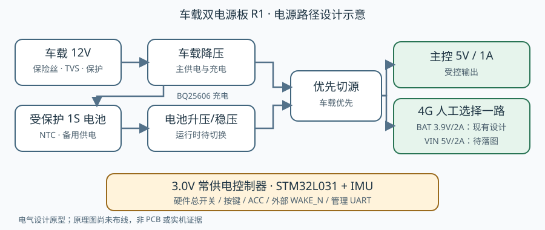

# 车载双电源模块

独立电源板设计：车载 12V 和带保护板的单节锂聚合物电池供电，给主控提供受控 **5V / 1A**。4G 供电目标改为人工选择 **BAT 约 3.9V / 2A** 或 **VIN 5V 类 / 2A**；电源板不识别所接模块。目标主控包括 AtomS3 Lite；其他项目可按[复用接口](docs/reuse.md)评估接入。

**状态：`prototype`。四页 EasyEDA Pro 工程已放置 299 件元件，保存重载并回读了 VIN 新增的 78 件核心与外围；全部仍未布线。没有可制板文件、可烧录固件或实板验证，不得按此资料直接装车。** 设计示意如下；它不是 PCB 或实机照片。



## 设计范围

| 部分 | 设计输入与目标 |
| --- | --- |
| 车载输入 | 12V 电瓶直连加 ACC，或点烟器输入；板上保险丝、TVS、反接与过压保护后降压；上游仍需合适保险丝 |
| 备用电池 | 1S、满充 4.2V、约 3000mAh；须自带保护板、贴电芯 NTC，连续放电能力至少 9A |
| 主控输出 | 受控 5V / 1A；AtomS3 Lite 等主控需另核对准确板版次和输入脚位 |
| 4G 输出 | 电气源数据包含受控约 3.9V / 2A BAT 与独立标称 5V / 2A VIN，人工断电选择其一；两路尚未写成 EDA 导线。VIN 电压范围和压降分析见[原理图绘制依据](docs/vin-schematic-r2.md) |
| 开关与唤醒 | 独立电源键、双刀硬件总开关、ACC、板载 IMU 与外部开漏唤醒；STM32L031 常供电控制器的固件尚未实现 |

现有主控及 BAT 输出各有螺丝端子、XH **2.50mm** 插座和 **2.54mm** 排针，三个端口并联且共享该路电流额定值；VIN 输出的三种端子已放置但尚未接线。现有针脚、时序、UART 协议和掉电边界以[接口与控制合同](hardware/vehicle-dual-power-r1/interfaces-and-control.md)为准；电路与器件请看[硬件设计](hardware/vehicle-dual-power-r1/README.md)。

## 复现现有设计检查

需要 Python 3。从本项目目录执行 `./tests/run.sh`；它在 `hardware/vehicle-dual-power-r1/` 中依次运行：

```sh
python3 tools/build_design.py
python3 tools/calculate.py
python3 tools/calculate_vin.py
python3 -m unittest discover -s tests -v
```

这些脚本生成引脚网络源数据、BOM 和参数计算，并检查电气**设计意图**；不会向 EasyEDA 原理图写导线。EasyEDA Pro 工程 UUID 和四页信息见 [eda-project.json](hardware/vehicle-dual-power-r1/eda-project.json)。编辑器内仍显示历史名称 `MotoBox Vehicle Dual Power R1`，工程身份保持不变。本项目没有固件，因此没有烧录或运行步骤；预期的当前输出是脚本通过、四页工程可打开检查元件，不能由此推断板上输出已建立。

## 接线与验收边界

原理图未完成布线、NC 标记和最终 DRC；输出端子尚未形成可按图接线的实板。实际接线前必须核对电池极性、NTC、电芯保护、Tiny 修订版和 UART 电平，且测量端子与线束压降。调试 USB 可能绕过本板的主控关机；需隔离 VBUS。

现阶段验证结果及首板验收条件见[项目验证记录](docs/validation.md)。其他项目可按[复用接口](docs/reuse.md)评估本模块，保留自己的主控适配和实测记录；不要把这里的设计测试记为整机硬件验证。
