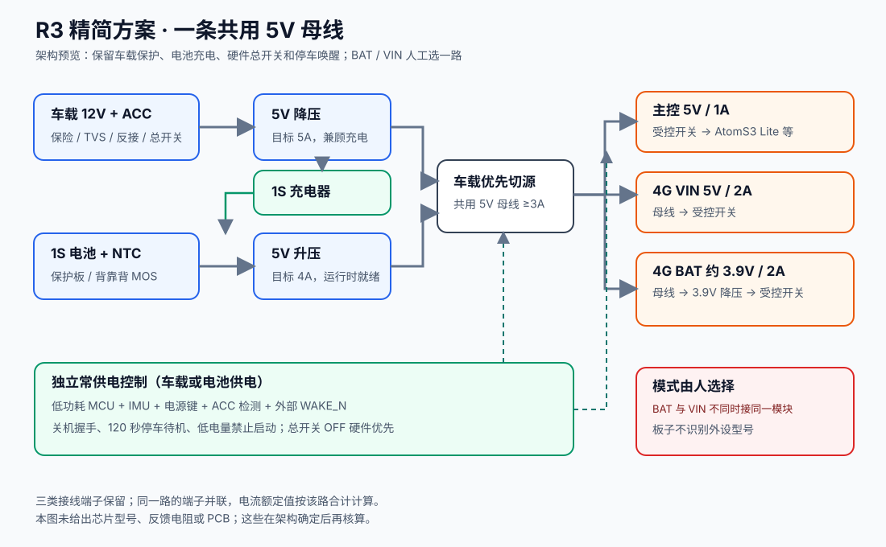

# R3 精简电源架构预览

**状态：架构评审稿。** 这份图只确定必要功能和电源容量，不是已布线原理图、最终 BOM 或可制板文件。现有 R2 四页 EasyEDA 工程保留作对照，尚未按此图修改。

## 必要电路

1. **车载输入**：保险丝、TVS、反接/过压及硬件总开关控制；一路 5V 降压。ACC 只进检测电路，不直接接单片机引脚。
2. **电池输入**：带保护板和贴附 NTC 的 1S 锂聚合物电池；硬件总开关控制背靠背 MOS；一路 5V 升压。车载 5V 经充电芯片给电池充电，软关机时可充电，总开关 OFF 时充电停止。
3. **共用 5V 母线**：车载优先切源。车载和电池同时存在时由车载供负载；运行中电池升压支路保持可切换，停车待机时关闭升压。
4. **三个受控输出**：主控 5V/1A；4G VIN 5V/2A；4G BAT 经母线降压到约 3.9V/2A。BAT 与 VIN 由低电流模式开关人工选一路，不能接到同一模块的两个输入。电源板不识别模块。
5. **独立低功耗控制**：车载与电池都能给常供电域供电。低功耗 MCU、IMU、按键、ACC 和外部开漏唤醒负责上电、关机握手、120 秒停车静止判断与低电量禁止启动。主控接口保留掉电隔离；总开关 OFF 不依赖 MCU 固件。
6. **接线端子**：车载输入及每路输出保留螺丝端子、XH 2.50mm 插座和 2.54mm 排针。相同输出的三个端子并联，合计额定电流不变；BAT 和 VIN 端子必须明显区分。

## 先冻结的容量

| 位置 | 初步设计容量 | 理由 |
| --- | --- | --- |
| 共用 5V 母线与切源 | 连续至少 3A，按 4G 脉冲留裕量 | VIN 档：主控 1A + 4G 2A；BAT 档经 3.9V 降压后的母线负载略低于 3A |
| 车载 5V 降压 | 目标连续 5A | 3A 负载与约 600mA 电池充电输入同时存在，另留启动与温升裕量 |
| 电池 5V 升压 | 目标连续 4A | 支持两路负载与切源瞬态，按加载电池最低电压复核输入峰值电流 |
| 电池及保护板 | 1S、约 3000mAh，连续放电至少 9A | 5V×3A、升压效率暂按 85%、加载电池 3.0V 时，平均输入约 5.9A；脉冲另测 |
| 常供电域 | 七天静置目标 ≤0.2mA，验收 ≤0.5mA | 包含 IMU、外部唤醒传感器、AON 电源和漏电 |

## 与 R2 相比删去的重复路径

- 不再为主控、4G BAT 和 4G VIN 各建独立的车载/电池切源和前级稳压链。
- 删除 VIN 专用的 6.5V 车载降压、6.5V 电池升压、专用切源及再降到 5V 的四级路径。
- 3.9V BAT 档只保留母线到 BAT 的一个稳压级与受控输出；VIN 档直接由共用 5V 母线经过受控开关输出。

车载保护、充电、电池硬件隔离和常供电唤醒不能因为精简而省去。器件型号、反馈网络、MOS 温升、输出压降、4G 脉冲和真实件数须在原理图阶段核算；此时不承诺完整 BOM 数量或 5V 端点全条件公差。
