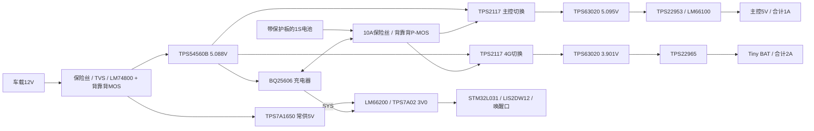

# R1 电气设计与计算

本文件配合 [连接源数据](source/design.json)、[BOM](bom.csv) 和 [可重复计算](calculations.json) 阅读。
计算属于设计检查；效率、温升、切换波形和真实耗电仍需实测。
本文件计算仅对应 R1 的 BAT 3.9V 支路；新增 VIN 5V 类/2A 的[双模式功率预算](../../docs/power-output-modes.md)尚未进入原理图或本 BOM。

## 架构

两路负载各有一个电源切换器和稳压器。电池到输出的路径一直连接到切换器，运行时可立即接替车载输入。
静置时关闭两个 TPS63020 和两个负载开关。BQ25606 的 SYS 只承担常供电部分，主控和 4G 的大电流从 `BAT_SW` 分支走。

`VEH_PROT → TPS7A1650 → LM66200 → 3V0_AON` 无需 MCU 使能，因此无电池也能冷启动。
ACC 存在或按键启动后，控制器再使能主降压器；不能把这个常供电 LDO 接到主降压器的输出。

## 关键元件和连接

| 电路 | 选择与约束 |
|---|---|
| 车载保护 | LM74800QDRRRQ1 / C3215600；CSD19534Q5A / C114200 两只，共漏极。LM74800 第13脚 RTN **悬空**，不可接地 |
| 车载 TVS | Vishay SMBJ33CA-M3/5B / C1982094；33V 双向。其钳位随浪涌电流变化，不能据此声明通过 ISO 7637 或任意负载突降 |
| 降压 | TPS54560BQDDAQ1 / C1355305；6.8µH XAL7070-682MEC / C3911753；B560C / C266541 阴极接 SW |
| 电池主隔离 | DMP2008UFG-7 / C461052 两只，共源极，栅极有1MΩ回源极；开关 ON 拉低栅极，OFF 将栅极接到共源极 |
| 充电 | BQ25606RGER / C374063；VSET 悬空选择4.208V；CE 经2N7002控制，复位默认禁充；OTG接地 |
| 电源切换 | TPS2117DRLR / C22399676 两只；MODE接VIN1，PR1分压330k/100k，标称4.3V优先阈值；每颗4A |
| 稳压 | TPS63020DSJR / C15483 两只；PS/SYNC 接各自输入，运行使用固定PWM；停机EN低 |
| 主控断开 | TPS22953DQCR / C471046 真正断开；SNS直接接其OUT；后接LM66100DCKR / C2869734，CE接其VOUT阻止USB反灌 |
| 4G断开 | TPS22965DSGR / C122837，关闭时输出放电；Tiny VIN必须留空 |
| AON | LM66200DRLR / C3235556，ON#接地；TPS7A0230PDBVR / C3747031输出3.0V |
| 串口 | 两组TXU0202DCUR / C5186957；参考电源取自主控3.3V和相应受控电源域 |

每个同功能物理引脚都在连接源中单独登记。XT30的3、4脚为固定脚，不接功率网络。
DMP2008的库封装把共同漏极铜区表示为5号焊盘，不能自行补造6～8号网络脚。

## 电压、电流与热预算

稳压器反馈公式为 `Vout = Vref × (1 + R上 / R下)`。

| 项目 | 参数 / 计算结果 |
|---|---|
| 车载降压 | 0.8V × (1 + 53.6k/10k) = **5.088V**；243k设置约400kHz |
| 主控稳压 | 0.5V × (1 + (90.9k+1k)/10k) = **5.095V**；反馈电阻0.1%、25ppm/K |
| 4G稳压 | 0.5V × (1 + 100k/14.7k) = **3.901V**；反馈电阻0.1%、25ppm/K |
| 主控负载端预算 | 约**4.767～5.221V**，含开关、反向阻断器和≤60mΩ线缆/接点回路 |
| Tiny负载端预算 | 约**3.637～3.997V**，2A、开关25mΩ、线缆/接点回路≤60mΩ |
| 低电量运行边界 | `BAT_SW`实际≥3.40V；按每路3A和切换器38mΩ估算，稳压器输入≥3.286V |
| 电池电流 | 按85%效率，主控约1.85A、4G约2.83A，合计约**4.68A**，未计很小的AON电流 |
| 电池MOS损耗 | 使用13mΩ/只、温升系数1.6的保守设计分配，两只约**0.91W**；这个系数不是厂家保证值 |
| 单个电源切换器 | 较重一路约**0.31W**；须按真实铜面积检验温升 |
| 车载降压负载 | 两路稳压85%效率，再留0.85A给充电/AON，约**3.93A**；按4A持续设计和测试 |

电压端点中的额外±1%线性/负载调整量、85%效率、温升系数都是待验证的设计分配。
TPS63020平均电流限值的3.5A最小值只列在VIN=3.6V、25°C条件下，不能外推为任意低温、低电压下的保证。
满载低电量启动必须做单独测试。板上电池连接器、保险丝及铜箔还需要承受启动脉冲。

主控ADC采样取在 `HOST_SW`，即LM66100之前。若取最终 `HOST_5V`，外接USB可能经ADC保护二极管反灌AON。
负载端电压仍需通过测试点/连接器实测，不能把这个ADC值直接等同Atom板端电压。

### 电感、电容和启动

- TPS63020使用1.5µH Würth 74438357015 / C2651165，输出各3×22µF。厂家2026年数据表给出DCR最大20mΩ、10%电感下降时饱和电流典型5.55A；实际版次按采购复核。
- 主降压输出6×22µF/25V。补偿16.9k＋4.7nF串联、47pF并联，参考TI典型应用。换用6.8µH及不同有效电容后，仍要量测环路/负载瞬态，未声称补偿已验证。
- 每路切换器输出4×22µF，稳压器输入另有2×22µF。陶瓷电容必须考虑直流偏压；BOM标称容量不能直接用作有效容量。
- Tiny端470µF/6.3V Panasonic 6SVP470M / C128503＋22µF。大电容放在负载开关之后，避免其漏电进入静置预算。470µF按−20%计算为376µF；2A阶跃维持20µs约下降106mV，再加约30mV ESR压降。
- 20µs只是分析场景，TPS2117切换时间没有可用于此处保证的最大值。切换波形必须与4G脉冲一起实测。
- 两个负载开关CT均10nF/50V，满足TPS22953的≥25V要求。TPS22965典型上升时间约15ms，470µF典型充电涌流约0.123A；实际负载自启动电流另计。
- 主控末端1µF和10kΩ泄放只保证本板小电容的放电。Atom及外接模块增加电容后，测量实际掉电时间；调试USB接通时主控仍会运行。

## 电池与充电温度

采购要求：有过充、过放、短路及过流保护的1S锂聚合物电池，约3000mAh，连续放电≥9A，
允许此充电器的4.208V标称、4.229V容差上限和约0.51～0.72A充电范围。必须以电芯厂规格核对，不以外观判断。
板上10A保险丝不替代电池保护板；保护板静态耗电需要实测/规格保证。

- ICHG电阻1.1kΩ，标称615mA；计电阻1%约511～722mA。
- ILIM=620Ω，未知适配器模式标称0.771A。D+/D−悬空，不模拟USB DCP；实测确认检测结果，避免误用与ILIM不同的自动限流档。
- NTC采用时恒MF52B 103F3950-100 / C394021，贴附在电芯上；不要只量电源板温度。
- `REGN → 9.76k → TS`，`TS → 1.5M → GND`，NTC另由TS接到GND。
- 使用厂家真实R/T上下界，另叠加电阻1%和60K×100ppm/K温漂。冷停充约**1.56～4.99°C**，热停充约**39.29～42.45°C**。
- 开路NTC使TS偏高，短路使TS偏低，均禁止充电。
- 原芯片JEITA温区随分压移动：约7～10°C以下减半电流，约29～32°C以上降低到约4.05V充电。
- 该配置提供保守温度窗口，不宣称能在0°C或45°C仍正常充电；没有绕开芯片硬件温度保护。

## 静置与总开关

完整分项见[计算结果](calculations.json)。典型目标约**189.8µA**，分配余量后约**374.1µA**；验收仍是实测≤500µA。
外部传感器以约50µA作为目标，100µA作为余量分配；接口10mA是供电能力上限。
MCU需进入Stop并限制周期唤醒；LIS2DW12按12.5Hz低功耗模式；关闭主控、4G和调试器。
不得在AON上加常亮LED。持续拉低唤醒口会额外消耗约30µA，固件去抖不能消除这个电阻电流。

七天静置约消耗31.9mAh（目标），≤0.5mA时为84mAh；未包含运动唤醒、4G发送、电芯自放电、容量衰减。

SW101小拨动开关只切控制信号，额定6V；车载控制经44kΩ和5.1V稳压管，不把12V接到触点。
OFF时两个电源功率路径都断开；车载控制分压、TVS和保护器仍有漏电/静态电流。12V时分压支路约0.16mA，另加保护芯片和TVS漏电；电池侧另有MOS及外置保护板漏电。

当前C&K开关的规格限制环境为**−20～70°C**，电池另受自身规格限制；本版本不能据个别Q1芯片宣称全板为车规或适合发动机舱。
高温泊车、反接、启动跌落、24V误接及浪涌测试条件须在实板验收记录中逐项给出。

## 资料来源

- [LM7480-Q1](https://www.ti.com/lit/ds/symlink/lm7480-q1.pdf)、[TPS54560B-Q1](https://www.ti.com/lit/ds/symlink/tps54560b-q1.pdf)
- [BQ25606](https://www.ti.com/lit/ds/symlink/bq25606.pdf)、[TPS2117](https://www.ti.com/lit/ds/symlink/tps2117.pdf)、[TPS63020](https://www.ti.com/lit/ds/symlink/tps63020.pdf)
- [TPS22953/4](https://www.ti.com/lit/ds/symlink/tps22954.pdf)、[TPS22965](https://www.ti.com/lit/ds/symlink/tps22965.pdf)、[LM66100](https://www.ti.com/lit/ds/symlink/lm66100.pdf)
- [LM66200](https://www.ti.com/lit/ds/symlink/lm66200.pdf)、[TPS7A16](https://www.ti.com/lit/ds/symlink/tps7a16.pdf)、[TPS7A02](https://www.ti.com/lit/ds/symlink/tps7a02.pdf)、[TXU0202](https://www.ti.com/lit/ds/symlink/txu0202.pdf)
- [Würth 74438357015](https://www.we-online.com/components/products/datasheet/74438357015.pdf)；其他器件的精确来源见BOM和[器件锁定表](source/selected-parts.json)。
- Tiny的BAT 3.4～4.2V、VIN互斥和丝印来自此前用户提供的商品图/手册截图，证据边界见[MotoBox验证记录](../../../m5stack-sticks3-gps-motobox/docs/validation.md)。尚未取得独立厂家原理图来验证该板所有内部电源路径。
